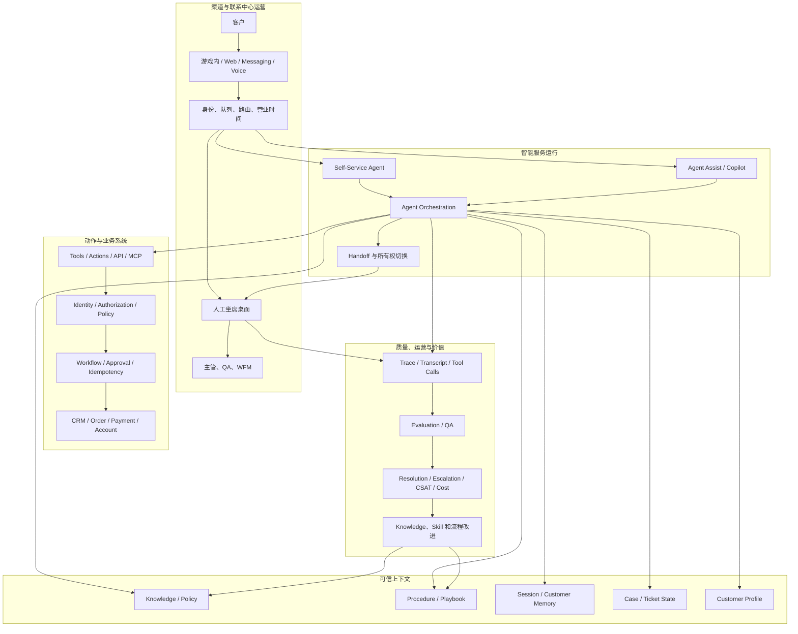

# 权威资料中的智能客服定位、主流实践与规划基线

> 状态：External Market Baseline  
> 基准日期：2026-08-18  
> 上位设计：[智能客服全景心智模型](intelligent-customer-service-mental-model.md)  
> 实施参考：[游戏内智能客服 MVP 实现与演进规划](game-customer-service-mvp-roadmap.md)

## 1. 研究目的

本文回答四个问题：

1. 主流云厂商、CRM 和 CCaaS 厂商如何定位智能客服？
2. 官方技术资料反复出现了哪些架构模式和实施顺序？
3. 这些市场实践与现有九平面心智模型是否一致？
4. 哪些能力值得补充进更完整的智能客服生态模型？

本文不是厂商选型报告，也不比较模型排行榜、许可价格或营销指标。研究对象限定为：

- AWS、Google Cloud 和 Microsoft 官方技术文档或技术博客。
- Salesforce、ServiceNow、Genesys 和 Zendesk 官方文档、官方技术博客或官方学习资料。
- 截至基准日期仍可通过实际 HTTP GET 请求访问的页面。

## 2. 证据与表述规则

### 2.1 证据等级

| 标记 | 含义 |
|---|---|
| 官方事实 | 来源页面直接描述的产品能力、建议或指标定义 |
| 跨厂商共识 | 至少三个不同厂商的官方资料体现相同方向 |
| 本文归纳 | 基于多个来源形成的架构或规划判断，不代表任一厂商原话 |
| 本项目建议 | 面向游戏智能客服 MVP 的具体取舍 |

### 2.2 研究边界

- 厂商资料可以证明其公开定位和产品能力，不能独立证明实际项目效果。
- 本文不采用厂商自报的自动化率、ROI 或市场预测作为通用事实。
- 不把“页面提到某能力”解释为该能力在所有区域、版本和许可证中默认可用。
- 不使用搜索摘要中可以发现、但自动化可达性检查返回 `403` 的页面作为主要出处。
- 链接检查只能说明在检查时可达，不能保证未来 URL 永不调整。

## 3. 核心结论

### 3.1 市场对智能客服的主流定位

跨厂商资料体现的共同定位不是“用聊天机器人替代客服”，而是：

> 将客户自助、人工坐席增强、业务流程执行、人工升级和运营质量管理整合为一个面向解决结果的服务系统。

主流产品通常同时覆盖三种运行模式：

| 运行模式 | 主要使用者 | 目标 |
|---|---|---|
| Customer Self-Service | 客户 | 直接回答问题或完成低风险任务 |
| Agent Assist / Copilot | 人工客服 | 提供知识、摘要、建议动作和事后整理 |
| Supervisor / Quality Operations | 主管和运营团队 | 评测交互、发现缺口、优化流程和管理风险 |

这一判断可以从以下官方材料交叉验证：

- Amazon Connect 同时提供客户自助、实时坐席辅助、人工升级和交互质量评测。[AWS-1][AWS-2][AWS-3]
- Google Cloud 将 Virtual Agent 和 Agent Assist 视为共同改善客户体验与运营效率的组成部分，并将实时 Agent Assist 描述为一种较安全的起步方式。[GCP-1][GCP-2]
- Genesys 同时建设 Virtual Agent、Agent Copilot、转接摘要和运营仪表板。[GEN-1][GEN-2]
- Salesforce Trailhead 将 AI Agent 与人工客服统一在同一服务体系中。[SF-1]
- Zendesk 从可信知识回答逐步扩展到流程、动作、API 集成、人工升级和分析。[ZD-1][ZD-2][ZD-3]

### 3.2 “解决问题”正在取代“生成回答”

官方资料中的智能客服能力正在从：

```text
搜索知识 -> 生成回复
```

演进为：

```text
理解问题
  -> 检索受信知识和客户上下文
  -> 选择流程或动作
  -> 调用业务工具
  -> 验证结果
  -> 解决、继续追问或转人工
```

官方事实包括：

- Amazon Connect 推荐的 Agentic Self-Service 使用编排型 AI Agent，支持多步推理、MCP 工具和持续对话，直到问题解决或需要升级。[AWS-1]
- Salesforce 官方资料将 Agent Action 定位为对数据和工作流执行任务的构件，并强调在 Agent 生命周期中定义职责、权限和可执行动作。[SF-2]
- Zendesk 的入门路径从可信知识开始，再进入目标导向流程、授权动作和既有系统 API 集成。[ZD-1]
- Google Cloud 区分信息型生成 Agent 与受控的交易型对话，并以 Playbook 承载处理步骤。[GCP-3]

因此，市场主流方向与本项目的核心定义一致：

> 智能客服的价值单位应是 Successful Resolution，而不是一次自然语言回复。

### 3.3 人工接管是正式能力，不是失败兜底

不同厂商的官方资料都把 Handoff 设计为正式产品能力：

- Microsoft Copilot Studio 在转人工时传递完整对话历史和相关变量。[MS-2]
- Google Cloud 的 Agent Handoff 会让虚拟 Agent 静默，并由 Agent Assist 创建人工参与者继续会话。[GCP-4]
- Salesforce 强调人工客服在同一支持控制台获得客户已经提供的上下文，避免客户重复描述。[SF-3]
- Zendesk 要求上线前设计复杂、紧急或敏感问题的升级策略，并建议在升级前收集必要信息。[ZD-2]
- Amazon Connect 的自助 Agent 默认包含完成和升级路径，并保留对话上下文。[AWS-1][AWS-2]

跨厂商共识是：

```text
Handoff = 所有权切换 + 完整上下文 + 正确队列路由 + 客户连续体验
```

它不只是 Agent 输出一句“请联系人工客服”。

### 3.4 低风险增量演进优于一次性全自动化

厂商资料没有形成完全相同的实施顺序，但呈现出稳定的风险递增逻辑：

1. 建立可信知识、内容质量和评测基线。
2. 先增强人工客服，降低直接面向客户的错误风险。
3. 开放有限范围的客户自助。
4. 接入经过身份验证的只读查询。
5. 接入需要确认、Policy 或工作流控制的写操作。
6. 扩展到多渠道、主动服务和更复杂的跨系统任务。

代表性官方依据：

- Google Cloud 将实时 Agent Assist 描述为生成式 AI 联系中心转型中自然、快速且较安全的第一步。[GCP-1]
- Zendesk 明确建议从可信知识源回答开始，再使用生成式流程、脚本对话、授权动作和 API 集成。[ZD-1]
- Google Cloud 的 IVA-only 方案允许保留既有电话、CRM 和客服界面，以旁路方式增加虚拟 Agent，而不是先整体替换联系中心。[GCP-5]
- AWS 从 PoC 到生产的官方案例依次补充 Memory、Gateway、Identity、安全控制和可观测性。[AWS-8]

### 3.5 结果指标正在替代单纯 Deflection

市场资料中更成熟的指标不只统计机器人接待量：

- Zendesk 区分 Assisted Escalation、Contained Resolution 和 Verified Resolution。[ZD-4]
- Genesys Virtual Agent 仪表板跟踪 Containment、Transfer、Agent Escalation、Abandonment、Recognition Failure 和 Error。[GEN-2]
- Amazon Connect 可以使用生成式 AI 评测客户交互，覆盖问题是否解决、合规性和敏感数据处理，并提供转录证据。[AWS-3]
- AgentCore Evaluations 支持针对 Agent 和工具的持续或批量评测。[AWS-7]

因此，推荐将指标分为：

```text
Resolution Outcome
  + Customer Experience
  + Decision Quality
  + Action Safety
  + Operational Efficiency
  + Unit Economics
```

而不是把“未转人工”自动视为成功。

## 4. 代表性厂商定位与技术能力

| 厂商 | 官方定位重点 | 核心技术能力 | 对规划的主要启示 |
|---|---|---|---|
| AWS / Amazon Connect | Agentic Self-Service、实时坐席辅助、人工升级和质量评测 | 多步编排、MCP 工具、Security Profile、Guardrail、Handoff、交互评测 | 自助 Agent 必须同时具备工具、权限边界、人工路径和评测 [AWS-1][AWS-2][AWS-3] |
| AWS / AgentCore | 将自定义 Agent 推进到可连接、可治理、可观察和可评测的生产环境 | Runtime/Harness、Memory、Gateway、Identity、Policy、Observability、Evaluations | Agent Loop 只是运行核心，生产体系还需要外围治理平面 [AWS-4][AWS-5][AWS-6][AWS-7][AWS-8] |
| Google Cloud | Virtual Agent 与 Agent Assist 共同组成客户服务 AI | Agent Assist、Virtual Agent、Playbook、Contact Center 集成、上下文 Handoff | Agent Assist 可以作为低风险起点，并能旁路接入既有客服基础设施 [GCP-1][GCP-2][GCP-4][GCP-5] |
| Microsoft | 基于受信来源的客户自助，与 Engagement Hub 和人工客服连接 | Generative Answers、数据连接器、完整历史和变量 Handoff、Omnichannel | Agent 与联系中心的适配器和交接契约需要显式设计 [MS-1][MS-2] |
| Salesforce | AI Agent 和人工客服统一在 CRM、渠道、数据和工作流中 | Agent Actions、Flow/API、客户上下文、Handoff、测试部署和治理 | 客服 Agent 应围绕 Case、客户数据和既有业务流程构建 [SF-1][SF-2][SF-3] |
| ServiceNow | 自助、坐席生产力、工作流执行和统一 AI 治理 | Virtual Agent、Agentic Workflow、AI Agent Studio、分析与 CSAT | 智能客服应连接服务履约工作流，而不应停留在聊天层 [SN-1][SN-2] |
| Genesys | Virtual Agent、Agent Copilot 和联系中心运营分析 | 实时建议、知识、摘要、Wrap-up、转接摘要、Virtual Agent Analytics | 坐席桌面、队列和运营指标是智能客服生态的核心组成部分 [GEN-1][GEN-2] |
| Zendesk | 从知识型 AI Agent 逐步扩展到流程、动作、渠道和结果计量 | Trusted Knowledge、Procedures、Authorized Actions、API、Escalation、Resolution Metrics | MVP 应从内容准备开始，并以真实解决结果而非对话量衡量价值 [ZD-1][ZD-2][ZD-3][ZD-4] |

## 5. 市场主流参考架构

以下架构是本文基于多家官方资料形成的归纳，不代表某一家厂商的产品图：



## 6. 主流实施与演进路径

### 6.1 Phase 0：定义业务结果和风险边界

先回答：

- 哪些问题代表真正的“解决”？
- 哪些动作可以自动执行？
- 哪些情况必须客户确认、审批或转人工？
- 工单、订单和支付的权威系统分别是什么？
- 如何区分 Assisted、Contained 和 Verified Resolution？

交付物：

- 高频意图和工单基线。
- 风险分级和自动化边界。
- Handoff 条件和目标队列。
- Golden Set 和现状业务指标。

### 6.2 Phase 1：可信知识与 Agent Assist

能力：

- 基于受信知识的回答建议。
- 实时知识推荐。
- 对话摘要和 Wrap-up。
- 人工客服保留最终输出权。

价值：

- 降低直接面向客户的模型风险。
- 验证知识覆盖、术语和建议准确性。
- 形成评测集和人工修正反馈。

市场依据：Google Cloud 将 Agent Assist 定位为较安全的第一步；Genesys 和 Amazon Connect 都把知识推荐、摘要和坐席辅助作为独立能力。[GCP-1][GEN-1][AWS-2]

### 6.3 Phase 2：有限客户自助

能力：

- FAQ、政策、活动和常见错误回答。
- 明确的能力边界和人工升级入口。
- 记录完整对话、引用和失败原因。

上线条件：

- 知识来源受治理。
- Handoff 能够传递摘要、历史和必要变量。
- 未知、敏感和低置信问题有确定路径。
- 能够区分“回答过”和“真正解决”。

### 6.4 Phase 3：可信身份下的只读业务查询

能力：

- 订单、充值、发货和工单状态查询。
- 客户身份到业务对象的可信绑定。
- Tool Call、参数、结果和授权决策可追踪。

这一阶段把智能客服从 RAG 推进到问题调查，但仍限制业务副作用。

### 6.5 Phase 4：受控业务动作

能力：

- 补发、预约、取消、退款申请或修改工单。
- 用户确认、授权策略、幂等键和工作流审批。
- 动作执行后的结果验证、失败补偿和审计。

官方产品通常以 Action、Flow、API、MCP Tool 或 Workflow 表达此能力。[AWS-1][SF-2][ZD-1]

但多数客服产品文档并未完整说明副作用 Ledger、任务取消和补偿事务，因此仍需要采用本项目在案例研究中吸收的事务安全模型。

### 6.6 Phase 5：多渠道、主动服务与持续优化

能力：

- Voice、Messaging、游戏内和工单渠道连续服务。
- 主动通知和异常事件触发。
- 主管运营、自动 QA、知识缺口发现和工作流优化。
- 根据业务结果持续调整 Prompt、Skill、工具和路由策略。

这一阶段的前提是前四阶段已经建立清晰的身份、Case、Handoff、Policy 和 Evaluation 边界。

## 7. 与九平面心智模型的 Mapping

| 九平面 | 市场资料支持度 | 主要官方证据 | 判断 |
|---|---|---|---|
| 1. 客户体验与渠道 | 强 | Google IVA、Microsoft Engagement Hub、Salesforce 和 Zendesk Omnichannel | 与模型一致 |
| 2. 会话流量控制 | 弱至中 | 厂商强调路由和 Handoff，但较少公开消息合并、Version、Cancel | 当前模型比公开产品资料更完整 |
| 3. Agent 决策 | 强 | Amazon Connect Orchestrator、Salesforce Agent、Google Playbook | 与模型一致 |
| 4. 上下文资产 | 强 | 各厂商均强调可信知识、客户上下文和流程指导 | 与 `KB / Skill / Memory` 边界一致 |
| 5. 能力与动作治理 | 强 | MCP、Actions、Flow、API、Security Profile、Policy | 与模型一致 |
| 6. 业务流程与事务安全 | 中 | 厂商强调 Workflow 和授权动作，但很少公开 Side-effect Ledger 和补偿细节 | 应保留现有增强设计 |
| 7. 人工协同 | 很强 | 所有主要资料都强调上下文 Handoff 和人工继续处理 | 与模型高度一致 |
| 8. 质量与治理 | 很强 | AgentCore Evaluations、Connect QA、Genesys/Zendesk Dashboard、Salesforce Lifecycle | 与模型高度一致 |
| 9. 价值与 FinOps | 强 | Resolution、Containment、Escalation、CSAT、AHT 和自动化计量 | 应强化“成功解决成本” |

### 7.1 已被市场事实强化的现有判断

以下设计可以继续作为基线：

- 智能客服是解决系统，不是单纯 RAG。
- Agent、人工客服和业务工作流必须在同一 Case 上协作。
- Handoff 是正式业务路径。
- 实时业务系统高于知识和 Memory。
- 写操作需要确定性策略和事务保护。
- 质量评测必须覆盖回复、决策、工具和业务结果。
- 自动化价值应以成功解决结果衡量。

### 7.2 现有模型值得进一步补充的生态能力

#### A. Contact Center Operations Overlay

主流 CCaaS 产品反复出现以下能力：

- Queue 和 Skill-based Routing。
- 营业时间、等待队列和溢出规则。
- Agent Desktop。
- Supervisor Monitoring。
- Quality Management。
- Workforce Management。
- After-contact Work。

现有九平面已经覆盖渠道和人工协同，但这些能力分散在多个平面。后续可以增加一个跨平面的：

```text
Contact Center Operations Overlay
```

它不替代九平面，而是说明 AI 如何进入既有客服运营系统。

#### B. Agent Assist 作为独立产品表面

当前模型主要从“机器人处理 -> 转人工”描述人机协同。市场资料显示，Agent Assist 本身应被视为独立运行模式：

```text
同一套 KB、Skill、Memory 和 Tool
  -> 面向客户时由 Self-Service Agent 使用
  -> 面向人工时由 Agent Assist 使用
```

这可以提高资产复用率，并为自动化前的低风险验证提供路径。

#### C. Case Management Control Plane

Salesforce、ServiceNow 和 Zendesk 的共同特点是：

- 每次交互最终落到 Case、Ticket 或 Workflow。
- AI 和人工围绕同一业务对象协作。
- 路由、状态、负责人、SLA 和处理结果由 Case 系统承载。

现有模型已经把工单数据库定义为权威状态，但可以进一步将其提升为：

```text
Case Management Control Plane
```

Memory 负责连续性，Case 负责业务责任和服务履约。

#### D. Resolution Outcome Taxonomy

建议统一结果分类：

```text
UNASSISTED
ASSISTED_ESCALATION
CONTAINED
VERIFIED_RESOLUTION
FAILED
ABANDONED
REOPENED
```

该分类吸收了 Zendesk 的分层解决指标和 Genesys 的 Virtual Agent Outcome，同时保留重开和失败等业务结果。[ZD-4][GEN-2]

#### E. Conversation Design 与 Voice Engineering

市场中的语音客服还涉及：

- 实时转录。
- 流式响应。
- 打断和抢话。
- 静音与录音隐私。
- 语音延迟。
- 直接转接与队列转接。

这部分不应塞进通用 Agent Loop。未来引入语音时，应作为渠道平面的专门工程域。

## 8. 对游戏内智能客服 MVP 的规划含义

### 8.1 推荐双路径，而不是只做机器人

```text
路径 A：Customer Self-Service
  FAQ + 充值查询 + 发货查询 + Handoff

路径 B：Agent Assist
  知识建议 + 工单摘要 + 相似案例 + 建议下一步
```

两条路径复用：

- 同一受治理 KB。
- 同一 Skills / Playbooks。
- 同一 Gateway 工具。
- 同一 Case 数据。
- 同一 Trace 和评测体系。

### 8.2 对当前路线图的验证

现有路线图中的以下顺序与市场主流实践一致：

1. 一个产品、一个渠道和有限意图。
2. 先处理知识和只读查询。
3. 通过可信身份绑定业务对象。
4. 写操作增加确认、Policy、Ledger 和工作流。
5. 无法可靠处理时完整转人工。
6. 使用 Resolution、Reopen、CSAT、Tool Success 和 Cost 评估。

### 8.3 建议增加的 MVP 交付物

- 人工客服 Agent Assist 只读侧边栏或建议接口。
- 明确的 Case/Ticket 事件契约。
- `ASSISTED_ESCALATION`、`CONTAINED` 和 `VERIFIED_RESOLUTION` 结果字段。
- 队列、营业时间、人工可用性和 Handoff 失败处理。
- 主管视角的失败意图、升级原因、工具失败和重开分析。
- 上线前的人工客服培训、反馈入口和建议采纳率指标。

这些属于客服生态能力，不需要扩大第一版 Agent 的自主权限。

## 9. 关键指标基线

### 9.1 客户结果

- Verified Resolution Rate。
- First Contact Resolution。
- Reopen / Repeat Contact Rate。
- CSAT 或 Bot Satisfaction。
- Handoff 后客户重复描述率。

### 9.2 Agent 决策与回答

- Intent / Route Accuracy。
- Groundedness 和 Citation Correctness。
- Tool Selection Accuracy。
- Handoff Precision / Recall。
- Policy Violation 和 Unsafe Action Rate。

### 9.3 执行质量

- Tool Success Rate。
- Write Action Confirmation Rate。
- Duplicate Side Effect Rate。
- Workflow Failure / Compensation Rate。
- Case State Consistency。

### 9.4 运营与成本

- Containment 和 Assisted Escalation。
- Average Handle Time。
- After-contact Work Time。
- p50 / p95 / p99 Latency。
- Token 和工具调用成本。
- Cost per Verified Resolution。

## 10. 来源可达性审计

### 10.1 检查方法

检查时间：`2026-08-18`  
方法：对每个引用 URL 发起实际 HTTP `GET`，允许重定向，设置 `30s` 超时，并记录最终 URL 和 HTTP 状态。

纳入标准：

- 最终状态必须为 `200`。
- 不纳入 `404` 页面。
- 自动检查返回 `403` 的候选页面不作为主要出处，即使搜索引擎可以发现其内容。

### 10.2 AWS

| ID | 官方来源 | 最终状态 |
|---|---|---|
| AWS-1 | [Use agentic self-service](https://docs.aws.amazon.com/connect/latest/adminguide/agentic-self-service.html) | `200` |
| AWS-2 | [Use AI agents for real-time assistance](https://docs.aws.amazon.com/connect/latest/adminguide/connect-ai-agent.html) | `200` |
| AWS-3 | [Evaluate agent performance using generative AI](https://docs.aws.amazon.com/connect/latest/adminguide/generative-ai-performance-evaluations.html) | `200` |
| AWS-4 | [Operational practices for agentic AI systems](https://docs.aws.amazon.com/wellarchitected/latest/agentic-ai-lens/agentops01.html) | `200` |
| AWS-5 | [Observability and monitoring for agentic systems](https://docs.aws.amazon.com/wellarchitected/latest/agentic-ai-lens/agentops05.html) | `200` |
| AWS-6 | [Policy in Amazon Bedrock AgentCore](https://docs.aws.amazon.com/bedrock-agentcore/latest/devguide/policy.html) | `200` |
| AWS-7 | [Evaluate agent performance with AgentCore Evaluations](https://docs.aws.amazon.com/bedrock-agentcore/latest/devguide/evaluations.html) | `200` |
| AWS-8 | [Move AI agents from proof of concept to production with AgentCore](https://aws.amazon.com/blogs/machine-learning/move-your-ai-agents-from-proof-of-concept-to-production-with-amazon-bedrock-agentcore/) | `200` |

### 10.3 Google Cloud

| ID | 官方来源 | 最终状态 |
|---|---|---|
| GCP-1 | [How gen AI is transforming the customer service experience](https://cloud.google.com/blog/products/ai-machine-learning/how-gen-ai-is-transforming-the-customer-service-experience) | `200` |
| GCP-2 | [About virtual agents](https://docs.cloud.google.com/contact-center/ccai-platform/docs/virtual-agent) | `200` |
| GCP-3 | [How generative AI can be used in the contact center](https://cloud.google.com/blog/topics/telecommunications/how-generative-ai-can-be-used-in-the-contact-center) | `200` |
| GCP-4 | [CX Agent Studio handoff](https://docs.cloud.google.com/gemini-enterprise-cx/agent-assist/handoff-cxas) | `200` |
| GCP-5 | [Interactive Virtual Assistant guide](https://docs.cloud.google.com/contact-center/ccai-platform/docs/iva-guide) | `200` |

### 10.4 Microsoft

| ID | 官方来源 | 最终状态 |
|---|---|---|
| MS-1 | [Agents for customer engagement and handoff](https://learn.microsoft.com/en-us/microsoft-copilot-studio/customer-copilot-overview) | `200` |
| MS-2 | [Hand off to a live agent](https://learn.microsoft.com/en-us/microsoft-copilot-studio/advanced-hand-off) | `200` |

### 10.5 Salesforce

| ID | 官方来源 | 最终状态 |
|---|---|---|
| SF-1 | [Explore the evolution and benefits of Agentforce Service](https://trailhead.salesforce.com/content/learn/modules/service-cloud-platform-quick-look/get-to-know-the-service-cloud-platform) | `200` |
| SF-2 | [Build and govern your Agentforce](https://www.salesforce.com/blog/govern-agentforce-platform-roadmap/) | `200` |
| SF-3 | [AI agents are smart: knowing when to step aside](https://www.salesforce.com/blog/agent-to-human-handoff/) | `200` |

说明：Salesforce Architect 和 Developer 文档中的若干候选页面在自动 GET 检查中返回 `403`，因此本文没有将其作为主要引用，尽管这些页面可以被官方站内搜索发现。

### 10.6 ServiceNow

| ID | 官方来源 | 最终状态 |
|---|---|---|
| SN-1 | [Now Assist AI agents release notes](https://www.servicenow.com/docs/r/yokohama/release-notes/now-assist-ai-agents-rn.html) | `200` |
| SN-2 | [Virtual Agent release notes](https://www.servicenow.com/docs/r/yokohama/release-notes/virtual-agent-rn.html) | `200` |

### 10.7 Genesys

| ID | 官方来源 | 最终状态 |
|---|---|---|
| GEN-1 | [About Genesys Agent Copilot](https://help.genesys.cloud/?p=341897) | `200` |
| GEN-2 | [Virtual Agent performance dashboard](https://help.genesys.cloud/?p=376105) | `200` |

### 10.8 Zendesk

| ID | 官方来源 | 最终状态 |
|---|---|---|
| ZD-1 | [Getting started with AI agents](https://support.zendesk.com/hc/en-us/articles/8724978128282-Getting-started-with-AI-agents) | `200` |
| ZD-2 | [Configuring escalation strategies and flows](https://support.zendesk.com/hc/en-us/articles/8357756604186-Configuring-escalation-strategies-and-flows-for-AI-agents) | `200` |
| ZD-3 | [Analyzing AI agent performance](https://support.zendesk.com/hc/en-us/articles/9510024609178-Analyzing-AI-agent-performance-with-the-reporting-dashboard) | `200` |
| ZD-4 | [About automated resolution tiers](https://support.zendesk.com/hc/en-us/articles/9570369117338-About-automated-resolution-tiers) | `200` |

## 11. 最终判断

主流市场已经从“Chatbot + FAQ”进入：

```text
Self-Service Agent
  + Agent Assist
  + Trusted Knowledge
  + Procedures / Skills
  + Authorized Actions
  + Case Management
  + Contextual Handoff
  + Quality Operations
  + Resolution Economics
```

这与现有九平面心智模型总体高度一致。现有模型相较公开市场资料更突出的部分是：

- Conversation Dispatcher 和处理所有权。
- Side-effect Ledger 和事务补偿。
- KB、Skill、Memory 的严格职责边界。
- 受治理的跨工单共享经验。

市场资料最值得补入生态视图的部分是：

- Contact Center Operations Overlay。
- Agent Assist 独立运行模式。
- Case Management Control Plane。
- Resolution Outcome Taxonomy。
- 面向语音渠道的 Conversation Design 与实时媒体工程。

因此，下一版生态心智模型不需要推翻九平面，而应在其上增加“联系中心运营”和“人工坐席增强”两类跨平面视图。

[AWS-1]: https://docs.aws.amazon.com/connect/latest/adminguide/agentic-self-service.html
[AWS-2]: https://docs.aws.amazon.com/connect/latest/adminguide/connect-ai-agent.html
[AWS-3]: https://docs.aws.amazon.com/connect/latest/adminguide/generative-ai-performance-evaluations.html
[AWS-4]: https://docs.aws.amazon.com/wellarchitected/latest/agentic-ai-lens/agentops01.html
[AWS-5]: https://docs.aws.amazon.com/wellarchitected/latest/agentic-ai-lens/agentops05.html
[AWS-6]: https://docs.aws.amazon.com/bedrock-agentcore/latest/devguide/policy.html
[AWS-7]: https://docs.aws.amazon.com/bedrock-agentcore/latest/devguide/evaluations.html
[AWS-8]: https://aws.amazon.com/blogs/machine-learning/move-your-ai-agents-from-proof-of-concept-to-production-with-amazon-bedrock-agentcore/
[GCP-1]: https://cloud.google.com/blog/products/ai-machine-learning/how-gen-ai-is-transforming-the-customer-service-experience
[GCP-2]: https://docs.cloud.google.com/contact-center/ccai-platform/docs/virtual-agent
[GCP-3]: https://cloud.google.com/blog/topics/telecommunications/how-generative-ai-can-be-used-in-the-contact-center
[GCP-4]: https://docs.cloud.google.com/gemini-enterprise-cx/agent-assist/handoff-cxas
[GCP-5]: https://docs.cloud.google.com/contact-center/ccai-platform/docs/iva-guide
[MS-1]: https://learn.microsoft.com/en-us/microsoft-copilot-studio/customer-copilot-overview
[MS-2]: https://learn.microsoft.com/en-us/microsoft-copilot-studio/advanced-hand-off
[SF-1]: https://trailhead.salesforce.com/content/learn/modules/service-cloud-platform-quick-look/get-to-know-the-service-cloud-platform
[SF-2]: https://www.salesforce.com/blog/govern-agentforce-platform-roadmap/
[SF-3]: https://www.salesforce.com/blog/agent-to-human-handoff/
[SN-1]: https://www.servicenow.com/docs/r/yokohama/release-notes/now-assist-ai-agents-rn.html
[SN-2]: https://www.servicenow.com/docs/r/yokohama/release-notes/virtual-agent-rn.html
[GEN-1]: https://help.genesys.cloud/?p=341897
[GEN-2]: https://help.genesys.cloud/?p=376105
[ZD-1]: https://support.zendesk.com/hc/en-us/articles/8724978128282-Getting-started-with-AI-agents
[ZD-2]: https://support.zendesk.com/hc/en-us/articles/8357756604186-Configuring-escalation-strategies-and-flows-for-AI-agents
[ZD-3]: https://support.zendesk.com/hc/en-us/articles/9510024609178-Analyzing-AI-agent-performance-with-the-reporting-dashboard
[ZD-4]: https://support.zendesk.com/hc/en-us/articles/9570369117338-About-automated-resolution-tiers
