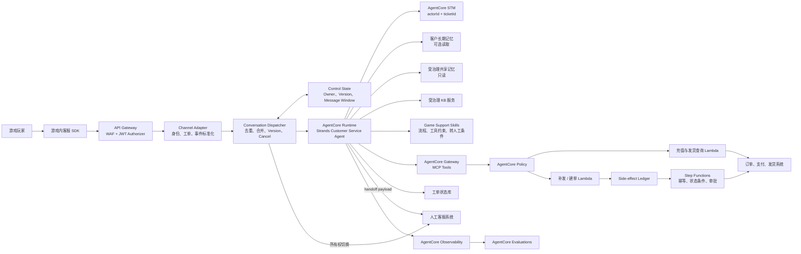
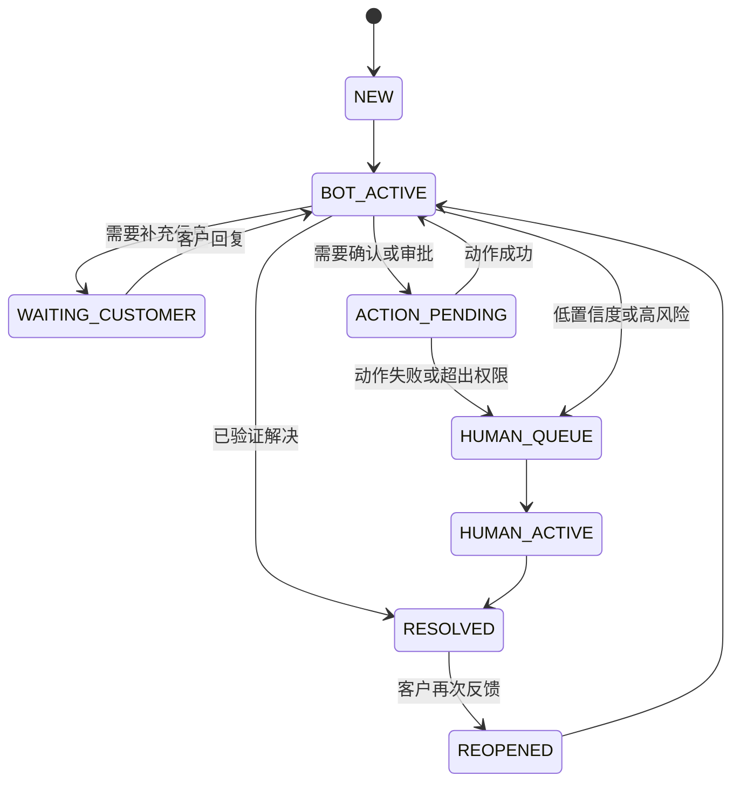

# 游戏内智能客服 MVP 实现与演进规划

> 状态：Proposed  
> 基准日期：2026-08-18  
> 上位设计：[智能客服全景心智模型](intelligent-customer-service-mental-model.md)
>
> 案例增强来源：[行业案例映射：某全球在线教育企业](industry-case-mapping-online-education.md)。  
> 本版已吸收 Dispatcher、Skill / Playbook 工程和 Side-effect Safety。
>
> 外部规划基线：[权威资料中的智能客服定位、主流实践与规划基线](authoritative-market-practices-intelligent-customer-service.md)。

## 1. 规划目标

构建一个可在游戏内投入小范围真实用户验证的智能客服系统，完成：

```text
游戏内提问
  -> 身份和工单绑定
  -> 知识回答或业务查询
  -> 必要时执行受控动作
  -> 无法处理时完整转人工
  -> 记录、评测和反馈
```

MVP 的目的不是证明模型会聊天，而是验证：

1. 高频问题能否被可靠理解和解决。
2. Agent 能否正确选择知识或业务工具。
3. 工具动作能否在可信身份和 Policy 控制下执行。
4. 多轮对话和转人工是否保持工单连续性。
5. 系统能否通过 Trace 和业务指标持续评测。
6. 连续消息、重复投递和人工接管时是否只有一个有效处理者。
7. 写操作在 Handler 取消、超时或重启后是否能够安全恢复。

## 2. MVP 范围假设

### 2.1 客群与渠道

- 一个游戏产品。
- 一个主要区域和语言。
- 游戏内已登录玩家。
- 一个游戏内文本客服入口。
- 一个既有人工客服或工单平台。
- 以小规模灰度用户或内部测试账号开始。

### 2.2 首批意图

| 意图 | 处理方式 | 风险 |
|---|---|---|
| 游戏玩法、活动规则、常见错误 | 受治理 KB 回答 | L0 |
| 查询充值记录 | Gateway 只读工具 | L1 |
| 查询充值发货状态 | Gateway 只读工具 | L1 |
| 充值成功但道具未到账 | 知识 + 两个只读工具 + 受控补发 | L2/L3 |
| 无法识别、证据不足或高风险问题 | 转人工 | Handoff |

### 2.3 MVP 暂不包含

- 多游戏、多租户和多区域统一运营。
- 语音客服。
- 账号找回、封禁申诉等高风险账号操作。
- 无人工确认的退款和高额赔偿。
- 多 Agent Supervisor。
- 主动营销或主动触达。
- 未审核经验自动进入共享记忆。

## 3. 目标架构



## 4. 技术选型

### 4.1 Agent 运行方式

MVP 推荐：

```text
AgentCore Runtime + Strands Agents
```

选择理由：

- 已有 `game-cs-agent` 的 Strands 逻辑可继续演进。
- 需要自定义上下文优先级和工单状态机。
- 需要显式构建人工 handoff payload。
- 需要对知识、客户记忆和共享经验进行独立检索。
- 需要自定义结案事件和旁路治理反馈。

Runtime 协议：

- 游戏内自建流式 UI：优先评估 `AG-UI`。
- 需要兼容现有 HTTP/Webhook 适配器：选择 `HTTP`。
- MVP 只选择一个协议，避免维护两套交互契约。

Harness 可作为后续低代码变体，用于简单 FAQ Agent 或客户快速 PoC，但不作为当前主实现。

### 4.2 模型策略

- 使用 Bedrock 上支持 Tool Use 的低延迟模型作为默认模型。
- 用更强模型离线执行评测、复杂工单分析或经验候选生成。
- 使用目标区域的 inference profile，并确认数据驻留要求。
- 显式设置 `maxTokens`、最大 Agent 迭代次数和超时。
- 模型 ID 和 inference profile 必须通过部署配置注入，不硬编码在业务代码中。

### 4.3 状态与记忆

```text
actorId          = Cognito sub 或稳定 customer UUID
memorySessionId  = ticketId
runtimeSessionId = 当前 Runtime 计算会话
```

| 数据 | 位置 |
|---|---|
| 当前对话事件 | AgentCore STM |
| 客户稳定偏好和历史摘要 | AgentCore LTM |
| 已审核团队经验 | 共享 Memory 治理平台 |
| 工单状态和 SLA | DynamoDB 或现有工单系统 |
| 支付、订单和发货状态 | 现有业务系统 |

### 4.4 工具与策略

第一版 MCP 工具集合：

```text
search_support_knowledge
get_player_recharge_records
get_recharge_fulfillment_status
request_recharge_redelivery
create_or_update_support_ticket
handoff_to_human
```

注意：

- KB 可以直接通过 SDK 调用，也可以被封装成受治理工具契约。
- `playerId` 必须由可信身份映射，不能使用模型提供的任意 ID。
- 每个写工具都必须支持幂等键。
- 工具返回结构化业务结果，不返回供模型解析的自由文本。
- 工具描述应明确适用条件、必填字段和错误语义。

### 4.5 会话流量控制

游戏内即时通信不是严格的“一问一答”。玩家可能连续发送：

```text
“我刚刚充值了”
“但是没有到账”
“订单号是 123”
```

MVP 应在 Agent 前增加 Conversation Dispatcher：

- 使用 `eventId` 去重。
- 在短窗口内合并连续消息。
- 为每次 Agent 处理分配单调递增的 `handlerVersion`。
- 新消息到达后向旧 Handler 发出取消信号。
- Agent 输出和写工具调用前必须再次检查 Version。
- 人工客服接管时原子切换 `processingOwner`。
- 被取消的 Handler 不得继续流式输出或启动新写操作。

控制状态至少包括：

```text
ticketId
latestEventId
handlerVersion
processingOwner
messageWindow
cancelRequested
updatedAt
```

控制状态可以使用 ElastiCache、DynamoDB 条件写或其他支持原子更新的存储实现。具体技术选择通过 ADR 决定。

> 案例依据：[行业案例映射：Dispatcher 并发仲裁](industry-case-mapping-online-education.md#56-dispatcher-并发仲裁)

### 4.6 Skills 与上下文预算

MVP 将 KB、Skills 和 Memory 作为三类不同资产：

```text
KB      = 正式事实和政策
Skill   = 场景处理流程
Memory  = 当前客户和历史工单经历
```

首批游戏客服 Skill：

```text
recharge-not-received
recharge-redelivery
refund-triage
gameplay-faq
human-handoff
game-terminology
```

每个 Skill 必须定义：

- 适用意图和排除条件。
- 所需可信上下文。
- 允许调用的工具。
- 需要客户确认的步骤。
- 必须转人工的条件。
- 成功、失败和补偿结果。
- 对应 Golden Set。

采用渐进加载：

```text
Level 1：Skill 名称、描述和适用意图
Level 2：完整流程和工具约束
Level 3：异常分支、参考和示例
```

每轮需要记录 Context Budget，至少区分 System、Skill、STM、Memory、KB 和 Tool Result Token。

> 案例依据：[行业案例映射：Skills 渐进加载](industry-case-mapping-online-education.md#52-skills-渐进加载)

## 5. 运行时处理流程

### 5.1 标准客服事件

渠道适配器向 Agent 提交统一事件：

```json
{
  "eventId": "evt-uuid",
  "ticketId": "ticket-uuid",
  "actorId": "customer-uuid",
  "runtimeSessionId": "runtime-session-uuid",
  "messageSequence": 42,
  "channel": "in_game",
  "locale": "zh-CN",
  "message": "我刚刚充值了但是没有收到道具",
  "controlContext": {
    "handlerVersion": 7,
    "processingOwner": "BOT_OWNED"
  },
  "trustedContext": {
    "gameId": "game-001",
    "serverId": "server-100",
    "playerId": "player-from-token",
    "region": "cn"
  }
}
```

客户端不得设置 `controlContext` 或 `trustedContext`：

- `controlContext` 由 Dispatcher 根据原子控制状态生成。
- `trustedContext` 由服务端根据 JWT、账号映射和游戏配置生成。

### 5.2 Dispatcher 流程

```text
1. 验证 eventId 并执行去重
2. 将消息加入 ticketId 对应的短窗口
3. 窗口关闭后合并消息
4. 原子递增 handlerVersion
5. 读取 processingOwner
6. 若人工已接管，只同步消息到人工工作台
7. 若机器人持有处理权，启动最新 Handler
8. 通知旧 Handler 取消
9. 旧 Handler 在输出和写操作前检查 Version
```

建议所有权状态：

```text
BOT_OWNED
HANDOFF_PENDING
HUMAN_OWNED
BOT_RESUME_PENDING
```

人工接管必须是原子状态变化，不应只依靠在对话历史中插入一条“人工已接管”消息。

### 5.3 Agent Loop

```text
1. 校验身份、ticketId、handlerVersion 和 processingOwner
2. 从工单库加载当前状态
3. 从 STM 恢复最近对话和当前问题摘要
4. 加载匹配的 Skill
5. 按需检索客户长期记忆和受治理共享经验
6. 判断意图、风险和缺失信息
7. 按需检索正式知识
8. 选择只读工具、受控写工具、追问或转人工
9. 写操作前再次检查 handlerVersion 和 processingOwner
10. Gateway 和 Policy 检查工具调用
11. Side-effect Ledger 检查幂等和既有动作
12. 验证工具结果与目标是否一致
13. 输出前再次检查 handlerVersion 和 processingOwner
14. 回复客户并写回 STM
15. 更新工单状态
16. 发出 Trace、评测和结案事件
```

Agent 被取消时：

- 不再生成新的客户可见内容。
- 不再启动新的工具调用。
- 已进入业务系统的写操作必须等待确定结果并写入 Ledger。
- 新 Handler 从 Ledger 恢复既有动作，而不是猜测是否已经执行。

### 5.4 工单状态机



工单状态存储在业务数据库中，而不是 Memory。

### 5.5 三类独立状态

| 状态 | 主要 Key | 回答的问题 |
|---|---|---|
| 会话控制状态 | `ticketId` | 当前哪个 Handler 和参与者有处理权？ |
| Memory Session | `actorId + ticketId` | 当前工单之前发生了什么？ |
| 工单业务状态 | `ticketId` | 问题处理到了哪个业务阶段？ |

三类状态可以引用同一个 `ticketId`，但生命周期、并发模型和权威性不同。

## 6. Policy 与自动化边界

### 6.1 MVP 策略矩阵

| 工具 | 身份约束 | 参数约束 | 执行约束 |
|---|---|---|---|
| `get_player_recharge_records` | `playerId == JWT mapped playerId` | 查询窗口不超过限制 | 自动 |
| `get_recharge_fulfillment_status` | 订单属于当前玩家 | 订单号格式合法 | 自动 |
| `request_recharge_redelivery` | 订单属于当前玩家 | 已支付、未发货、未补发 | 客户确认 + 幂等 |
| `create_or_update_support_ticket` | 当前 actor 可访问该工单 | 只允许指定字段 | 自动或确认 |
| `handoff_to_human` | 当前工单有效 | 必须包含 handoff 摘要 | 自动 |

建议演进：

```text
开发期：Policy LOG_ONLY
灰度前：检查被拒绝和本应拒绝的调用
灰度期：低风险工具 ENFORCE
后续：引入跨动作时序策略和额度控制
```

工具后端仍然必须重复执行授权和输入校验，不能只依赖 Agent Prompt。

### 6.2 Side-effect Safety

每个写操作必须携带：

```text
ticketId
actorId
handlerVersion
idempotencyKey
toolName
businessResourceId
workflowExecutionId
```

Side-effect Ledger 至少记录：

| 字段 | 用途 |
|---|---|
| `idempotencyKey` | 防止相同业务动作重复执行 |
| `handlerVersion` | 追踪动作由哪个 Handler 发起 |
| `status` | `REQUESTED / RUNNING / SUCCEEDED / FAILED / COMPENSATED` |
| `businessResultRef` | 指向业务系统的权威结果 |
| `startedAt / completedAt` | 审计和超时恢复 |
| `errorClass` | 区分可重试和不可重试错误 |

Handler 被取消时，不应尝试撤销已经提交的动作，而应：

1. 等待业务动作达到确定状态。
2. 将结果写入 Ledger。
3. 让最新 Handler 或人工客服从 Ledger 恢复。
4. 必要时启动显式补偿工作流。

> 案例吸收与修正：[行业案例映射：Side-effect Tracker 不等于事务保证](industry-case-mapping-online-education.md#93-side-effect-tracker-不等于事务保证)

## 7. 人工接管设计

### 7.1 触发条件

- 意图无法识别或多轮后仍缺少关键信息。
- KB、Memory 和工具结果互相冲突。
- 客户明确要求人工客服。
- 涉及退款、账号安全、高额赔偿或未成年人支付。
- 工具连续失败、Policy 拒绝或业务系统不可用。
- 负面情绪持续上升。
- Agent 达到最大迭代次数或超时。

### 7.2 Handoff Payload

```json
{
  "ticketId": "ticket-uuid",
  "handlerVersion": 7,
  "processingOwner": "HANDOFF_PENDING",
  "customerIntent": "充值成功但道具未到账",
  "summary": "客户在 14:03 充值，支付成功，发货流水缺失",
  "riskLevel": "L2",
  "verifiedFacts": [],
  "knowledgeReferences": [],
  "toolExecutions": [],
  "sideEffects": [],
  "failedAttempts": [],
  "pendingQuestions": [],
  "recommendedNextAction": "人工确认后重新触发发货"
}
```

人工客服修改 Agent 建议、补充原因码或改变最终动作时，应记录为结构化反馈。

### 7.3 处理所有权切换

人工接管不能只调用 `handoff_to_human` 后继续等待 Agent 自然结束。

标准流程：

```text
1. 原子更新 processingOwner = HANDOFF_PENDING
2. 递增 handlerVersion
3. 向当前 Handler 发送取消信号
4. 等待已开始的写动作进入确定状态
5. 生成包含 Side-effect Ledger 的 handoff payload
6. 更新 processingOwner = HUMAN_OWNED
7. 人工消息仅进入 STM 和工单时间线，不触发机器人回复
```

恢复机器人时需要新的显式操作：

```text
HUMAN_OWNED
  -> BOT_RESUME_PENDING
  -> 生成新的 handlerVersion
  -> BOT_OWNED
```

> 案例依据：[行业案例映射：人工客服随时介入](industry-case-mapping-online-education.md#人工客服随时介入)

## 8. 实施工作流

### W0. 场景与评测基线

交付物：

- Top Intent 列表和历史工单样本。
- 充值未到账主路径及异常分支。
- 连续消息、乱序、重复投递和人工抢占测试样本。
- 工具风险分级。
- 100 到 300 条 Golden Set。
- 当前人工处理基线。

退出条件：

- 每个 MVP 意图都有期望答案、期望工具和期望结果。
- 高风险动作和转人工条件已由业务 Owner 确认。

### W1. Agent 与渠道基础

交付物：

- 标准客服事件契约。
- 游戏内客服 UI 或渠道适配器。
- AgentCore Runtime + Strands Agent。
- JWT 校验和身份映射。
- Conversation Dispatcher。
- `eventId` 去重、消息合并和 Handler Version。
- AI / 人工处理所有权状态。
- 流式响应。
- 明确的 `maxTokens`、迭代和超时限制。

退出条件：

- 可以完成登录玩家的多轮文本会话。
- Runtime 重启后可以通过 STM 恢复当前工单。
- 玩家连续发消息时只产生一个有效回复。
- 人工接管后旧 Handler 不再输出或启动工具。

### W2. 知识与 Skills 闭环

交付物：

- 接入受治理 KB。
- 建立首批游戏客服 Skills。
- 实现 Skill 元数据和按需加载。
- 建立每轮 Context Budget。
- 引用、版本和知识缺口事件。
- 无答案、冲突和低置信度策略。
- Knowledge-level 和 Skill-level 离线评测。

退出条件：

- FAQ Golden Set 达到约定的引用正确率和 Faithfulness。
- 核心意图能够加载正确 Skill，且禁止工具约束生效。
- 知识不足时不会生成伪造政策。

### W3. 只读业务工具

交付物：

- Recharge 和 Fulfillment 查询工具。
- AgentCore Gateway MCP 工具。
- 可信 `playerId` 绑定。
- Policy `LOG_ONLY`。
- 结构化错误和重试语义。

退出条件：

- Agent 工具选择准确率达到验收阈值。
- 不存在跨玩家数据查询。
- 工具调用具有完整 Trace。

### W4. STM 与人工协同

交付物：

- `actorId + ticketId` Memory 设计。
- 上下文截断和摘要策略。
- 工单状态机。
- `handoff_to_human` 工具。
- 人工接管的原子所有权切换。
- Handler 取消和恢复协议。
- 人工工作台所需的 handoff payload。

退出条件：

- 机器人转人工后无需客户重新描述。
- 人工处理后可以继续同一个工单。
- 人工接管后不存在 AI 延迟回复。

### W5. 受控写操作

交付物：

- `request_recharge_redelivery`。
- 明确客户确认步骤。
- 幂等键和重复执行保护。
- Side-effect Ledger。
- Workflow Execution ID 和状态恢复。
- 可重试错误、不可重试错误和补偿动作。
- Step Functions 审批或确定性流程。
- Policy `ENFORCE`。

退出条件：

- 所有写动作都有授权、确认、幂等和结果验证。
- 故障注入时不会重复补发。
- Handler 在写操作过程中取消时，最新 Handler 能恢复确定结果。

### W6. 灰度与反馈

交付物：

- 内部用户和小比例真实用户灰度。
- AgentCore Evaluations 在线抽样。
- CloudWatch 业务和技术 Dashboard。
- 每日失败工单复盘。
- KB 缺口和共享经验候选事件。
- Skill 缺口和 Skill 版本反馈。
- Dispatcher 取消、所有权切换和 Side-effect 指标。

退出条件：

- 错误动作率低于硬性门槛。
- Handoff、重开率和客户投诉无异常上升。
- 可以明确计算每个已解决工单的成本。

## 9. 参考交付节奏

| 阶段 | 参考周期 | 结果 |
|---|---:|---|
| Phase 0：定义与基线 | 1 周 | 场景、工具、Golden Set、风险边界 |
| Phase 1：知识型 Copilot | 1 到 2 周 | KB、Skills、引用、Trace、人工审核 |
| Phase 2：只读自助客服 | 2 周 | 身份、Dispatcher、STM、查询工具、转人工 |
| Phase 3：受控动作 MVP | 2 周 | Ledger、补发流程、Policy、幂等、灰度 |
| Phase 4：业务验证 | 2 到 4 周 | 在线评测、运营复盘和收益结论 |

周期是 PoC/MVP 参考值，实际取决于游戏业务接口和人工客服系统的集成成本。

## 10. MVP 验收指标

### 10.1 硬性安全指标

```text
跨玩家数据访问 = 0
未经确认的 L2 写动作 = 0
自动执行 L3/L4 动作 = 0
重复补发 = 0
旧 Handler 客户可见输出 = 0
人工接管后的 AI 回复 = 0
缺少审计轨迹的工具调用 = 0
```

### 10.2 质量指标

建议先建立基线，再设置正式阈值：

| 指标 | MVP 观察目标 |
|---|---|
| 意图识别准确率 | 持续提升且关键意图无系统性混淆 |
| 消息合并正确率 | 连续消息被合并为完整意图，且不过度等待 |
| Handler 取消生效延迟 | 新消息和人工接管后快速停止旧处理 |
| 工具选择准确率 | 只读工具达到可灰度水平 |
| Skill 选择准确率 | 核心意图加载正确流程和工具约束 |
| 回答 Faithfulness | 正式政策回答均有可靠依据 |
| Handoff Precision | 高风险问题不被错误自动处理 |
| Side-effect 恢复率 | Handler 重启或取消后能恢复确定业务结果 |
| 首次解决率 | 相对人工或旧机器人基线提升 |
| 重开率 | 不高于人工基线 |
| p95 响应延迟 | 符合游戏内交互预期 |
| Cost per Successful Resolution | 可观测且随优化下降 |

### 10.3 不单独优化的指标

- Deflection Rate。
- 单轮回复率。
- 平均对话轮数。
- 模型评分。

这些指标必须结合“是否真正解决”和“是否产生错误动作”观察。

## 11. 评测体系

### 11.1 离线评测

Golden Set 每条样本包含：

```text
用户问题
工单上下文
客户身份与权限
预期意图
预期知识来源
允许和禁止的工具
预期工具参数
预期最终状态
是否必须转人工
```

除了标准单轮问题，还必须包含并发和故障场景：

```text
连续三条消息组成一个意图
相同 eventId 重复投递
新消息到达时旧 Handler 正在生成
人工接管时 Agent 正在调用只读工具
人工接管时写操作已经提交
写操作成功但 Handler 超时
业务系统返回未知状态
最新 Handler 恢复 Side-effect Ledger
```

每次变更以下内容时运行回归：

- 模型和 Prompt。
- Tool Schema 和描述。
- Skill 内容、元数据和版本。
- Policy。
- KB 版本。
- Memory 检索策略。
- Agent Loop 和上下文构建。
- Dispatcher 合并窗口和取消策略。

### 11.2 在线评测

- 对生产 Trace 进行 5% 到 10% 抽样起步。
- 评测回答帮助性、Faithfulness 和有害性。
- 自定义评测工具选择、参数正确性和转人工准确性。
- 监控旧 Handler 输出、人工接管延迟和 Side-effect 恢复。
- 将评测结果关联到最终工单结果，而不是只评价文本。

### 11.3 人工复盘

每日或每周复盘：

- 错误工具选择。
- Policy 拒绝。
- 消息合并错误或重复回复。
- 人工接管后 AI 仍然输出。
- Handler 被取消时存在未决写操作。
- 工具成功但客户未解决。
- 不必要转人工。
- 应转人工但未转。
- 人工对 Agent 建议的修改。
- 工单重开。

## 12. 演进路径

### Level 0：客服 Copilot

- Agent 只生成知识建议和工单摘要。
- 人工决定是否发送和执行。
- 用于建立数据、评测和信任基线。

### Level 1：只读自助客服

- 自动回答 FAQ。
- 自动查询充值和发货状态。
- Dispatcher 处理连续消息和旧 Handler 取消。
- STM 保证工单连续性。
- 无法处理时完整转人工。

### Level 2：受控业务动作

- 客户确认后执行可逆或低风险动作。
- Gateway + Policy + 幂等。
- Side-effect Ledger 和 Workflow Execution ID。
- 高风险动作进入 Step Functions 或人工审批。

### Level 3：个性化与经验复用

- 使用客户长期偏好减少重复询问。
- 读取受治理共享经验改善相似工单处理。
- 结案事件向 KB 和共享记忆治理平台提交候选。

### Level 4：多渠道与主动服务

- 游戏内、Web、工单和语音共享同一工单上下文。
- 根据已知故障和支付事件主动通知客户。
- 对渠道、语言和区域进行差异化策略控制。

### Level 5：专业 Agent 协作

只在单 Agent 工具模式无法满足时引入：

- 支付专业 Agent。
- 账号安全专业 Agent。
- 技术故障诊断 Agent。

多 Agent 不应作为 MVP 默认目标。确定性单步能力仍应实现为工具。

## 13. 主要风险与控制

| 风险 | 控制措施 |
|---|---|
| Prompt Injection 诱导工具越权 | Gateway Policy、后端授权、参数白名单 |
| 查询其他玩家数据 | JWT 到 playerId 的服务端绑定 |
| 重复补发 | 业务幂等键、状态条件和工作流锁 |
| 连续消息触发多个并发回复 | 消息合并、Handler Version 和输出前检查 |
| 人工接管后机器人继续处理 | 原子所有权切换、取消信号和工具前检查 |
| Handler 取消导致写操作状态丢失 | Side-effect Ledger、Workflow ID 和结果恢复 |
| Memory 中的旧状态影响判断 | 实时业务数据优先，Memory 非权威 |
| 客服经验污染 | 通过独立共享记忆治理项目审核发布 |
| KB 政策过期 | 来源版本、生效时间和 KB 治理 |
| Skill 流程过期或误加载 | Skill Owner、版本、回归集和允许工具约束 |
| 上下文持续膨胀 | Skill 渐进加载、STM 摘要和 Context Budget |
| 模型无限循环 | 最大迭代、`maxTokens`、超时和 Gateway 限流 |
| 日志泄露 PII | Trace 脱敏、KMS、访问控制和保留期 |
| 自动化掩盖真实未解决问题 | 关注重开率、CSAT 和最终业务结果 |

## 14. 推荐仓库结构

```text
.
├── apps/
│   ├── channel-adapter/
│   ├── conversation-dispatcher/
│   ├── agent-runtime/
│   └── support-console/
├── skills/
│   ├── recharge-not-received/
│   ├── recharge-redelivery/
│   ├── refund-triage/
│   └── human-handoff/
├── tools/
│   ├── recharge-query/
│   ├── fulfillment-query/
│   ├── redelivery/
│   └── handoff/
├── contracts/
│   ├── events/
│   ├── tools/
│   ├── skills/
│   ├── side-effects/
│   └── handoff/
├── workflows/
│   ├── redelivery/
│   └── compensation/
├── infra/
│   ├── runtime/
│   ├── dispatcher/
│   ├── gateway/
│   ├── policy/
│   ├── memory/
│   ├── side-effect-ledger/
│   └── observability/
├── evals/
│   ├── datasets/
│   ├── offline/
│   └── online/
└── docs/
```

## 15. 下一批 ADR

实施前建议补齐：

1. ADR-001：AgentCore Harness 与 Runtime 选择。
2. ADR-002：HTTP 与 AG-UI 协议选择。
3. ADR-003：`actorId`、`ticketId` 和 Runtime Session 映射。
4. ADR-004：工单数据库与现有客服系统的权威边界。
5. ADR-005：KB 服务契约和引用结构。
6. ADR-006：共享记忆检索和反馈契约。
7. ADR-007：Gateway Tool Schema 规范。
8. ADR-008：Policy 风险矩阵。
9. ADR-009：写操作确认、幂等和补偿策略。
10. ADR-010：离线与在线评测门槛。
11. ADR-011：Dispatcher 消息合并窗口与原子状态存储。
12. ADR-012：AI / 人工处理所有权和取消协议。
13. ADR-013：Skill 结构、版本、加载和回归契约。
14. ADR-014：Side-effect Ledger 与 Workflow 恢复协议。
15. ADR-015：Context Budget 和 Cost per Successful Resolution。

## 16. MVP Definition of Done

当且仅当以下条件全部满足，MVP 才算完成：

- 游戏内真实登录玩家可以创建并继续同一个客服工单。
- 玩家连续发送多条消息时只产生一个基于完整意图的有效处理。
- Agent 能正确处理约定的三类核心意图。
- FAQ 回答具有可追踪知识引用。
- 核心意图加载正确 Skill，且 Skill 的工具约束可以回归验证。
- 充值和发货查询绑定当前玩家身份。
- 当前工单可以跨 Runtime 实例恢复。
- 高风险和不确定问题能够完整转人工。
- 人工接管可以取消旧 Handler，且不会出现延迟 AI 回复。
- 受控写操作具备确认、授权、幂等和结果验证。
- Handler 取消、超时或重启后可以从 Side-effect Ledger 恢复业务结果。
- 每次模型、知识、Memory、Policy 和工具调用都有 Trace。
- Trace 包含 `eventId`、`handlerVersion`、`processingOwner`、Skill 和 Workflow ID。
- Golden Set 回归和在线抽样评测可重复运行。
- 可以用最终工单结果计算 Successful Resolution。

## 17. 案例联动与吸收记录

本路线图吸收了行业案例中已经被真实客服场景验证的问题，但对其实现进行了边界增强：

| 案例发现 | 本路线图吸收位置 | 增强或修正 |
|---|---|---|
| 连续消息导致多个 Handler 并发 | 目标架构、4.5、5.2、W1 | 增加 `eventId`、Version、Cancel 和所有权状态 |
| 人工消息需要让 AI 退出 | 5.2、7.3、DoD | 从“消息提示”升级为原子所有权切换 |
| Side-effect Tracker 恢复已执行动作 | 6.2、W5、风险控制 | 升级为 Ledger、幂等、状态条件和 Workflow ID |
| Skills 渐进加载 | 4.6、W2、ADR-013 | 增加 Skill 契约、Owner、允许工具和回归集 |
| Token 和响应优化 | 4.6、质量指标、ADR-015 | 从 Token 降幅升级为 Cost per Successful Resolution |
| Runtime + Memory 支持个性化 | 4.1、4.3、W4 | 保留客户记忆，同时明确实时状态必须查询业务系统 |

完整案例分析见：

- [与现有心智模型的 Mapping](industry-case-mapping-online-education.md#7-与现有心智模型的-mapping)
- [对游戏客服 MVP 的直接启示](industry-case-mapping-online-education.md#13-对游戏客服-mvp-的直接启示)
- [案例能力成熟度判断](industry-case-mapping-online-education.md#14-案例能力成熟度判断)
