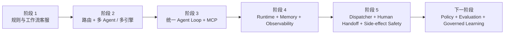
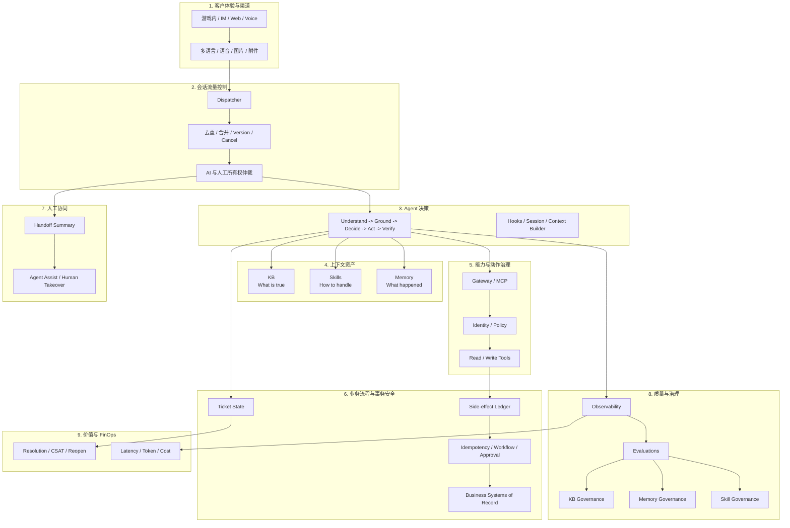

# 行业案例映射：某全球在线教育企业

> 状态：Case Study 01  
> 基准日期：2026-08-18  
> 上位设计：[智能客服全景心智模型](intelligent-customer-service-mental-model.md)  
> 案例来源：用户提供的 2026 峰会演示材料，本文已进行必要脱敏

## 1. 分析目的

本文不复述原始案例，而是回答三个问题：

1. 案例的智能客服核心价值主张是什么？
2. 案例中的实践与现有智能客服心智模型有哪些一致、部分一致或冲突之处？
3. 案例揭示了哪些可以补充进“智能客服大生态”心智模型的能力？

## 2. 脱敏与证据规则

### 2.1 脱敏处理

- 企业名称统一替换为“某全球在线教育企业”。
- 人员、合作方和具体渠道名称不作为分析重点。
- 精确工单量泛化为“日均万级”。
- 精确成本、NPS 和金额不直接用于结论。
- 业务动作泛化为“课程预约、取消和调整”等交易型客服动作。

### 2.2 证据等级

| 等级 | 含义 |
|---|---|
| 材料明确展示 | 演示文稿中直接给出架构、能力或指标 |
| 合理推断 | 可以从架构关系中推断，但材料没有明确说明 |
| 未展示 | 材料没有足够证据，不能视为已实现 |

案例中的效果和成本数字属于案例方自报，本文只将其作为价值方向，不进行独立背书。

## 3. 案例背景

案例面向一家全球在线教育企业，主要挑战包括：

- 全球多时区带来的全天候客服需求和明显峰谷流量。
- 日均万级咨询，人力排班和夜间服务成本较高。
- 预约、取消、调课、余额和课表查询等问题高度重复。
- 中英文混合沟通，需要动态语言和术语适配。
- 退款、投诉等敏感场景需要识别并升级。
- 即时通信渠道中，客户可能连续发送多条消息。
- 人工顾问可能在机器人处理过程中随时接管。

案例从基于工作流和路由的旧架构，演进到：

```text
统一 Agent Loop
  + MCP 工具
  + Skills
  + AgentCore Runtime
  + AgentCore Memory
  + Dispatcher 并发控制
  + Observability
```

## 4. 核心价值主张

### 4.1 从“回答问题”升级为“完成任务”

案例覆盖的不只是 FAQ，还包括：

- 查询账户和课时信息。
- 查询课程和预约历史。
- 查询可用时间。
- 预约、取消和调整课程。

其价值主张是：

> 通过 Agent 的多步推理和工具调用，把高频客服请求从知识回答推进到业务闭环。

这与现有心智模型中的“理解 -> Ground -> 决策 -> 执行 -> 验证”一致。

### 4.2 从固定工作流升级为动态 Agent Loop

旧方案依赖：

- 输入改写。
- 样本检索。
- 意图路由。
- 预设 Agent 或工作流。

新方案将这些过程收敛到一个可循环的 Agent 中：

```text
理解
  -> 选择 Skill
  -> 检索知识或记忆
  -> 调用工具
  -> 检查结果
  -> 必要时继续调用
  -> 回复
```

其主要收益不是“使用了更强模型”，而是：

- 上下文在同一 Agent Loop 内连续。
- 可以根据工具结果修正下一步。
- 减少路由层和多套框架之间的信息损失。
- 降低 Agent 编排代码和维护复杂度。

### 4.3 从通用回复升级为个性化连续服务

案例使用：

- Semantic Memory。
- User Preference Memory。
- Episodic Memory。

用于记住客户偏好、历史操作和过往问题，使客户可以使用“上次那节课”“按之前的时间”等模糊指代。

这与客户长期记忆的目标一致，但需要注意：

> 课程状态、账户状态和余额等实时业务数据不应以 Memory 为权威来源，仍需实时查询业务系统。

### 4.4 从人工排队升级为全天候弹性服务

案例强调：

- 全天候即时响应。
- 高峰流量自动伸缩。
- 低峰期按需付费。
- 人工客服集中处理敏感和复杂问题。

真正的价值不是完全替代人工，而是重构人机分工：

```text
机器人承担高频、标准、可验证事务
人工承担高风险、例外、情绪和关系管理
```

### 4.5 从功能建设升级为单位经济优化

案例把 Token、响应时间、运维工作量和人工成本放在同一个价值框架内。

值得保留的价值表达是：

- 单次成功解决成本下降。
- 非必要 Token 显著减少。
- 响应时间缩短。
- 自动伸缩减少闲置成本。
- Agent 框架代码和运维复杂度下降。

不应直接复用案例中的精确成本比例，因为其计算假设没有完整覆盖：

- 人工复核。
- 工单平台成本。
- 知识和记忆治理成本。
- 失败重试和转人工成本。
- 平台研发和持续评测成本。
- 业务错误动作成本。

## 5. 核心技术能力

### 5.1 统一 Agent Loop

材料明确展示：

- 原生思考、工具调用和响应循环。
- Hook 注入记忆检索和自动存储。
- Session Resume、Fork 和多轮上下文。
- 可调用 MCP 工具和 Skills。

架构含义：

- Agent 框架从业务流程的中心，退回到可替换的推理实现。
- AgentCore Runtime 承担计算、隔离、伸缩和观测。
- 业务能力以工具和 Skill 的形式独立演进。

### 5.2 Skills 渐进加载

案例将知识分为三层：

```text
Level 1：名称和描述，始终加载
Level 2：完整工作流，命中意图后加载
Level 3：扩展参考文件，需要细节时加载
```

Skills 用于承载：

- 预约流程。
- 取消流程。
- 调整流程。
- FAQ 使用策略。
- 业务术语。

这揭示了三种需要明确区分的上下文资产：

| 资产 | 回答的问题 | 例子 |
|---|---|---|
| Knowledge Base | 什么是正确事实或正式政策 | 退款政策、活动规则 |
| Skill / Playbook | 应该如何处理 | 预约、补发、退款处理步骤 |
| Memory | 过去发生了什么 | 客户偏好、历史问题、处理经历 |

现有心智模型提到了 Skills，但没有把“客服流程和处置 Playbook 工程”提升为独立治理对象。这是本案例带来的重要补充。

### 5.3 MCP 工具层

材料明确展示了一组远程 MCP 工具，覆盖：

- 知识检索。
- 账户查询。
- 课程查询。
- 预约、取消和调整。
- 可用时间和历史记录查询。

MCP 的核心价值：

- 统一工具协议。
- 工具与 Agent 解耦。
- 工具可以独立更新。
- 多种 Agent 框架可以复用同一能力。

材料没有明确展示：

- AgentCore Gateway。
- AgentCore Policy。
- 用户身份到工具参数的可信绑定。
- 工具级授权和风险分级。
- Gateway 边界的限流和审计。

因此，该案例体现了“工具标准化”，但没有完整展示“工具治理”。

### 5.4 AgentCore Runtime

材料明确展示：

- Agent 托管运行。
- 自动伸缩。
- VPC 模式。
- 固定出站路径以访问受限 MCP 服务。
- 每用户 Session 隔离。
- CloudWatch 与 ADOT Trace。

这与现有心智模型中的 Runtime、网络、安全隔离和 Observability 基本一致。

需要避免的误解：

> Runtime Session 隔离解决的是计算环境和会话隔离，不自动等同于持久工单状态、客户身份授权或业务数据隔离。

### 5.5 AgentCore Memory

案例明确采用三种长期记忆策略：

| 策略 | 案例用途 | 与心智模型的关系 |
|---|---|---|
| Semantic | 用户基本信息、历史事实 | 一致，但实时状态不应长期化 |
| User Preference | 偏好老师和时段 | 高度一致 |
| Episodic | 预约历史、取消原因、过往问题 | 一致，用于客户历史体验 |

案例没有展示：

- 当前工单使用 `actorId + ticketId` 的明确映射。
- STM 与 Runtime Session 的边界。
- 团队共享经验的治理和发布。
- Memory 记录的失效、纠错和删除流程。

因此它展示了“客户个性化记忆”，但未完整展示“工单连续性”和“跨客服共享经验治理”。

### 5.6 Dispatcher 并发仲裁

这是案例中最值得吸收的工程能力。

Dispatcher 处理三类问题：

#### 客户连续发送消息

通过版本号和 Redis Lua 原子操作：

- 新消息递增版本。
- 旧 Handler 检测到版本变化后退出。
- 只允许最新消息集合对应的 Handler 输出。

#### 人工客服随时介入

- 人工消息改变会话版本和所有权状态。
- 机器人快速检测到人工介入。
- AI 停止生成或停止继续调用工具。

#### 写操作副作用

- 记录已经执行的写操作。
- 新 Handler 恢复时加载执行轨迹。
- 避免因消息重算而遗忘之前的动作。

这说明：

> Agent Session 和 Memory 解决“记住什么”，Dispatcher 解决“此刻谁有权继续处理，以及哪个计算结果仍然有效”。

这是两类不同问题。

### 5.7 Side-effect Tracker

案例将写操作轨迹重新注入新 Handler 上下文，这比单纯保存聊天历史更可靠。

但对于游戏充值、补发和退款场景，应进一步升级为：

```text
Side-effect Ledger
  + Idempotency Key
  + Business State Condition
  + Workflow Execution ID
  + Compensating Action
```

仅将“已经执行过”告诉模型，不能提供 exactly-once 保证。最终防重必须由业务工具和业务系统实现。

### 5.8 多模态与多语言

案例展示：

- 中英文动态切换。
- 语音和图片理解。
- 专有业务术语 Skill。

这些能力说明客服的渠道层不只是传递文本，还需要：

- 语音转写。
- 图片和截图理解。
- Locale 和术语标准化。
- 附件安全检查。
- 将多模态输入转换为统一客服事件。

## 6. 架构演进路径

案例的实际演进可以抽象为五步：



### 阶段 1：规则和流程

- 适合明确、稳定的 FAQ。
- 修改慢，无法处理模糊和组合意图。

### 阶段 2：意图路由和多引擎

- 用路由和多个 Agent 扩大场景覆盖。
- 上下文割裂，路由错误难以自我修正。
- 框架、Prompt 和工具分散。

### 阶段 3：统一 Agent Loop

- 模型在同一循环中规划、调用工具和修正。
- 工具通过 MCP 标准化。
- Skills 承载流程和术语。

### 阶段 4：托管运行和记忆

- Runtime 提供隔离、伸缩和运行环境。
- Memory 提供客户连续性和个性化。
- Observability 提供链路可视化。

### 阶段 5：实时客服工程

- Dispatcher 管理并发消息。
- 人工介入能抢占 Agent。
- Side-effect Tracker 保护写操作。

### 下一阶段：确定性治理闭环

案例材料中尚未充分体现，但面向企业系统应补充：

- Identity。
- Gateway。
- Policy。
- 工单状态机。
- Agent Evaluations。
- KB 和共享记忆治理。
- 写操作工作流和审批。

## 7. 与现有心智模型的 Mapping

状态说明：

- `一致`：案例实践与心智模型原则基本相同。
- `部分一致`：方向一致，但缺少关键治理或边界。
- `缺口`：案例材料没有展示。
- `边界冲突`：材料中的表述如果直接推广，会破坏现有原则。

| 心智模型维度 | 案例实践 | 状态 | 判断与吸收建议 |
|---|---|---|---|
| 客户与渠道 | Webhook + Dispatcher + 流式响应 | 一致 | 比现有模型更深入，应吸收实时消息仲裁 |
| 可信身份绑定 | 会话和用户隔离 | 部分一致 | 未展示身份 Claims 到业务参数的可信绑定 |
| Agent 决策 | 统一循环、Hook、工具调用 | 一致 | 框架可替换，保留 Agent Loop 原则 |
| KB | 双知识源和检索工具 | 部分一致 | 未展示版本、ACL、引用和质量治理 |
| Skills | 渐进加载流程和术语 | 一致且有增量 | 应新增独立的 Skill / Playbook 工程 |
| STM | Session 历史和恢复 | 部分一致 | 未展示 ticketId 作为业务会话边界 |
| 客户长期记忆 | Semantic、Preference、Episodic | 一致 | 实时业务状态必须排除 |
| 共享经验 | 未展示 | 缺口 | 继续由独立共享记忆治理项目承担 |
| 工具标准化 | Remote MCP Server | 一致 | 工具协议层完整 |
| 工具授权 | 未展示 Gateway Policy | 缺口 | 游戏 MVP 必须补齐 |
| 业务事实源 | 工具访问排课和账户服务 | 一致 | 需要明确权威状态边界 |
| 写操作安全 | Side-effect Tracker | 部分一致 | 需升级为幂等、状态条件和工作流 |
| 人工接管 | 人工消息抢占 AI | 一致且有增量 | 增加会话所有权仲裁和取消机制 |
| 工单状态机 | 未明确展示 | 缺口 | Dispatcher 不能替代工单状态机 |
| Observability | Runtime Trace + CloudWatch + ADOT | 一致 | 需要继续关联最终业务结果 |
| Evaluations | 结果指标展示 | 部分一致 | 未展示可重复离线和在线评测体系 |
| 多语言 | 动态双语和术语 Skill | 一致且有增量 | 应纳入体验和上下文工程 |
| 多模态 | 语音和图片理解 | 部分一致 | 需要补充附件处理和安全边界 |
| 成本优化 | Skill 渐进加载和 Prompt Caching | 一致且有增量 | 上升为 Context Economy 能力 |
| 业务价值 | 响应、准确率、Token 和成本 | 部分一致 | 应增加首次解决率、重开率和错误动作率 |

## 8. 一致的实践

案例对现有心智模型提供了较强验证：

1. 智能客服需要 Agent Loop，而不仅是 RAG。
2. 业务闭环必须依靠工具调用。
3. 工具应与 Agent 解耦并标准化。
4. Runtime Session 和长期 Memory 都有独立价值。
5. 人工接管必须是一等能力。
6. 可观测性需要覆盖完整 Agent 执行链路。
7. 客服价值应同时衡量质量、响应速度和运营成本。
8. 流程知识不应全部塞入 System Prompt。

## 9. 部分一致或需要修正的实践

### 9.1 “单一引擎”是工程选择，不是架构目标

统一 Agent Loop 可以降低复杂度，但不能把系统重新绑定到某个特定 SDK。

长期稳定的边界应是：

```text
Agent Framework
  <-> Standard Tool Contract
  <-> Memory Contract
  <-> Knowledge Contract
  <-> Trace Contract
```

Claude Agent SDK、Strands 或其他框架都可以实现 Agent Loop。AgentCore Runtime 的价值之一就是允许框架替换。

### 9.2 Memory 不能保存实时账户状态

案例将“账户状态”列为 Semantic Memory 示例，这容易造成错误推广。

更合理的分类：

| 信息 | 存储位置 |
|---|---|
| 偏好老师和时段 | Preference Memory |
| 历史取消原因 | Episodic Memory |
| 客户稳定语言偏好 | Semantic / Preference Memory |
| 当前余额和课程状态 | 实时业务工具 |
| 当前工单状态 | 工单数据库 |

### 9.3 Side-effect Tracker 不等于事务保证

Side-effect Tracker 可以帮助 Agent 理解之前执行过的动作，但不能替代：

- 业务幂等。
- 条件写。
- 状态机。
- 分布式事务或 Saga。
- 失败补偿。

### 9.4 Session 隔离不等于完整安全治理

案例强调 Session 沙箱隔离，但企业客服还需要：

- 入口 JWT 或 IAM 鉴权。
- 用户到客户资源的授权。
- 工具参数校验。
- Gateway Policy。
- 敏感字段脱敏。
- Trace 和 Memory 的数据生命周期管理。

## 10. 对“智能客服大生态”心智模型的补充

该案例表明，原有六平面模型还需要显式增加三类能力。

### 10.1 新增：会话流量控制平面

职责：

- 消息合并和短暂 debounce。
- 事件去重。
- Handler 版本控制。
- 旧生成任务取消。
- 人工和机器人所有权切换。
- 流式响应仲裁。
- Channel Ack 和重试。

它解决的不是“Agent 记得什么”，而是：

> 在乱序、并发和抢占发生时，哪一条消息、哪一个 Handler、哪一个参与者仍然拥有输出和执行权。

### 10.2 新增：Skill / Playbook 工程平面

KB、Skill 和 Memory 应成为三类独立的上下文资产：

```text
KB      = What is true
Skill   = How to handle
Memory  = What happened before
```

Skill 治理应包含：

- Owner。
- 适用意图。
- 前置条件。
- 允许工具。
- 风险等级。
- 版本和回滚。
- 离线回归测试。
- 渐进加载和缓存策略。

### 10.3 新增：副作用与事务安全平面

职责：

- 工具调用幂等键。
- 写操作 Ledger。
- Workflow Execution ID。
- 状态条件。
- 重试策略。
- 补偿动作。
- 人工审批。
- Agent Handler 重启后的动作恢复。

它应位于 Agent 和业务系统之间，而不是只存在于 Prompt 或 Memory 中。

### 10.4 强化：上下文经济与 FinOps

上下文工程需要同时优化：

- 模型输入 Token。
- 检索次数。
- Memory 注入量。
- Skill 加载粒度。
- Prompt Cache 命中率。
- 工具返回体大小。
- 每个成功解决工单的总成本。

Token 降低不是最终目标。最终目标是：

```text
Cost per Successful Resolution
```

### 10.5 强化：多模态和本地化

全球客服需要：

- Locale 检测。
- 术语标准化。
- 翻译和原语言回复策略。
- 语音、截图和附件解析。
- 多模态内容安全。
- 不同市场的政策和工具路由。

## 11. 扩展后的智能客服生态模型



## 12. 三类时间尺度

案例还提示智能客服同时运行在三个时间尺度上：

| 时间尺度 | 典型时长 | 核心问题 | 主要组件 |
|---|---:|---|---|
| 交互时钟 | 毫秒到分钟 | 谁可以回复，哪个 Handler 有效 | Dispatcher、Runtime Session |
| 工单时钟 | 分钟到数天 | 问题处理到了什么状态 | STM、Ticket State、Workflow |
| 学习时钟 | 天到月 | 什么应沉淀为正式知识或经验 | KB、Skills、Shared Memory Governance |

将这三个时间尺度混合在一个 Agent Session 中，会产生：

- 并发回复。
- 工单状态丢失。
- 错误经验传播。
- 旧状态覆盖新状态。

## 13. 对游戏客服 MVP 的直接启示

### 13.1 P0：进入 MVP 基线

应立即加入现有游戏客服路线图：

1. Channel Dispatcher。
2. `eventId` 去重。
3. 短窗口消息合并。
4. Handler Version 和取消信号。
5. AI / 人工处理所有权。
6. 写工具幂等键。
7. Side-effect Ledger。
8. 工单状态与 Agent Session 分离。

游戏场景同样存在：

- 玩家连续发送“充值了”“没到账”“订单号是...”。
- 客服人员可能在机器人查询过程中介入。
- 重试或 Handler 重启可能导致重复补发。

### 13.2 P1：建立游戏客服 Skills

建议首批 Skill：

```text
recharge-not-received
recharge-redelivery
refund-triage
account-login-troubleshooting
gameplay-faq
human-handoff
game-terminology
```

每个 Skill 定义：

- 适用意图和排除条件。
- 所需可信上下文。
- 允许调用的工具。
- 需要客户确认的步骤。
- 必须转人工的条件。
- 成功和失败结果。

### 13.3 P1：补充上下文成本预算

为每轮推理建立预算：

```text
System + Policy context
Skill metadata
Loaded Skill
STM summary
Customer memory
Shared experience
KB chunks
Tool results
```

只有与当前决策有关的内容进入模型上下文。

### 13.4 P2：增强多模态

游戏客服常见输入包括：

- 充值截图。
- 报错截图。
- 游戏录屏。
- 设备日志。
- 语音投诉。

多模态能力应先服务于证据提取和工单结构化，而不是直接自动执行高风险动作。

## 14. 案例能力成熟度判断

| 能力 | 成熟度判断 |
|---|---|
| Agent Loop | 较成熟 |
| MCP 工具接入 | 较成熟 |
| Skills 渐进加载 | 较成熟 |
| Runtime 托管 | 较成熟 |
| 客户长期记忆 | 已形成明确设计 |
| 实时消息并发 | 有针对性工程方案 |
| 人工抢占 | 有针对性工程方案 |
| 写操作副作用追踪 | 已考虑，但需业务幂等增强 |
| 工具授权与 Policy | 材料未展示 |
| 工单状态机 | 材料未展示 |
| 共享经验治理 | 材料未展示 |
| KB 工程化治理 | 材料未展开 |
| 可重复评测体系 | 材料未展示 |
| 业务结果闭环 | 展示结果指标，但方法不完整 |

## 15. 总体结论

该案例与现有心智模型在以下主干上高度一致：

```text
Agent Loop
  + Knowledge
  + Memory
  + MCP Tools
  + Runtime
  + Human Handoff
  + Observability
```

它最重要的增量不是某个模型或 SDK，而是揭示了生产客服系统中的三项独立工程：

1. **Conversation Traffic Control**：管理并发消息、取消和人机所有权。
2. **Skill / Playbook Engineering**：把“如何处理”从 Prompt 和 KB 中独立出来。
3. **Side-effect Safety**：保护 Agent 重算、重试和抢占过程中的业务写操作。

因此，智能客服大生态可以进一步概括为：

> 客服渠道负责接入，Dispatcher 负责交互秩序，Agent 负责判断，KB/Skills/Memory 提供三类上下文，Gateway/Policy 负责动作边界，Workflow 和业务系统负责可靠执行，人工负责例外，治理与评测负责持续进化。

## 16. 案例材料索引

| 主题 | 原演示页 |
|---|---:|
| 业务挑战 | 5 |
| 目标能力 | 6 |
| Agent SDK、Hook、Session | 7-8 |
| 新旧架构 | 9-10 |
| 技术架构 | 11-12 |
| Skills 渐进加载 | 14 |
| Runtime 与 Memory | 15 |
| Dispatcher、人工介入和 Side-effect | 16 |
| 效果和业务价值 | 18-21 |

