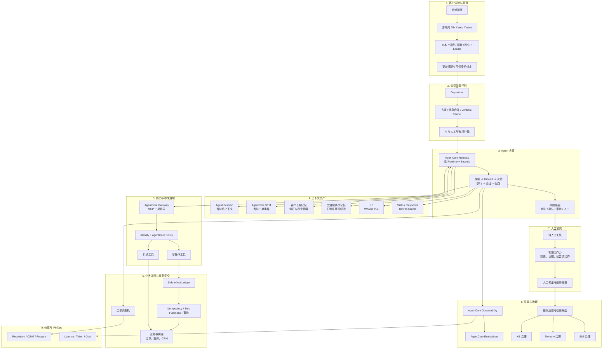
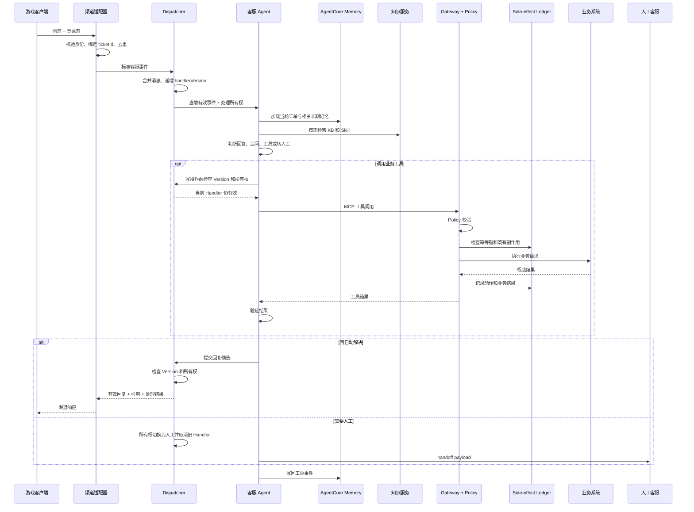

# 智能客服全景心智模型

> 状态：Baseline  
> 基准日期：2026-08-18  
> 适用范围：面向 MVP 和参考架构的游戏智能客服方案
>
> 案例增强：会话流量控制、Skill / Playbook 工程和副作用安全来自  
> [行业案例映射：某全球在线教育企业](industry-case-mapping-online-education.md) 的实践验证。
>
> 市场验证：[权威资料中的智能客服定位、主流实践与规划基线](authoritative-market-practices-intelligent-customer-service.md)。

## 1. 核心定义

智能客服不是“会聊天的 RAG”，而是：

> 以工单为业务单元、以 Agent 为决策中枢、以工具为执行手段、以确定性策略为安全边界、以人工客服为风险兜底的问题解决系统。

它的闭环不是“提问 -> 回答”，而是：

```text
理解问题
  -> 获取可信上下文
  -> 决定是否采取动作
  -> 在授权边界内执行
  -> 验证执行结果
  -> 回复或转人工
  -> 记录、评测和学习
```

### 1.1 系统目标

- 减少客户重复描述问题。
- 提高高频问题的首次解决率。
- 自动完成低风险、可验证的业务动作。
- 在连续消息、重复投递和人工抢占下保持单一有效处理者。
- 让写操作在 Handler 取消、超时和重启后仍可恢复、可审计且不重复。
- 为人工客服提供完整的上下文和处理建议。
- 对每一次回答和动作保留证据、策略决策和执行轨迹。
- 从已完成工单中产生可治理的知识和经验反馈。

### 1.2 非目标

- 不以单纯提高机器人拦截率为目标。
- 不让模型直接决定身份、权限、退款额度或赔偿金额。
- 不使用 Memory 保存订单、支付或工单的权威状态。
- 不使用聊天历史代替会话并发控制、业务幂等或事务状态。
- 不让未经验证的客户陈述自动进入共享经验。
- 不在 MVP 阶段引入不必要的多 Agent 系统。

## 2. 全景架构



## 3. 九个架构平面

### 3.1 客户体验与渠道平面

职责：

- 接收游戏内、Web、第三方工单平台或语音渠道事件。
- 将文本、语音、图片、附件转换为统一客服事件。
- 检测 Locale，标准化游戏术语和错误码。
- 绑定可信客户身份、游戏、区域、服务器和工单。
- 管理流式响应、重试和渠道回执。

渠道层不应把原始客户端参数直接传给业务工具。`playerId`、`tenantId` 和权限声明必须由服务端从可信身份中解析。

### 3.2 会话流量控制平面

会话流量控制解决的是：

> 在并发、乱序、重试和人工抢占发生时，哪条消息、哪个 Handler、哪个参与者仍然拥有输出和执行权。

职责：

- 使用 `eventId` 去重。
- 对客户短时间连续发送的消息进行窗口合并。
- 为每次处理分配单调递增的 `handlerVersion`。
- 当新消息或人工消息到达时取消旧 Handler。
- 防止旧 Handler 继续输出流式文本或调用写工具。
- 管理 `BOT_OWNED`、`HUMAN_OWNED` 和 `HANDOFF_PENDING` 等所有权状态。

这一平面不应由 Agent Session 或 Memory 替代。Memory 记录过去发生了什么，Dispatcher 决定当前谁还能继续处理。

> 案例依据：[行业案例映射：Dispatcher 并发仲裁](industry-case-mapping-online-education.md#56-dispatcher-并发仲裁)

### 3.3 Agent 决策平面

职责：

- 理解意图和当前问题阶段。
- 判断需要查询 KB、Skill、Memory 还是业务系统。
- 从允许的工具集合中选择下一步动作。
- 验证工具结果是否足以回答问题。
- 判断继续追问、执行、结束或转人工。

推荐实现选择：

| 条件 | 选择 |
|---|---|
| 标准 Agent Loop，主要由模型、Prompt、工具和 Memory 构成 | AgentCore Harness |
| 需要自定义上下文构建、工单状态机、特殊 Hook 或自定义流式协议 | AgentCore Runtime + Strands |
| 需要确定性长流程 | Step Functions，而不是交给 Agent 自由循环 |
| 需要复杂独立推理的专业角色 | 在明确收益后再引入子 Agent |

对于游戏客服参考实现，推荐 `AgentCore Runtime + Strands`，原因是需要显式控制身份绑定、会话流量、工单状态、上下文优先级、人工接管和结案事件。

Agent 框架是可替换的推理实现，不应成为知识、工具、Memory 或 Trace 的永久耦合点。

### 3.4 上下文资产平面

上下文应区分三种资产：

```text
KB      = What is true
Skill   = How to handle
Memory  = What happened before
```

#### 状态与记忆边界

| 状态类型 | 存储 | 主要用途 | 是否权威 |
|---|---|---|---|
| Model Context | 当前模型请求 | 本次推理 | 否 |
| Agent Session | Agent 进程中的热上下文 | 当前 Runtime Session 内高效连续推理 | 否 |
| AgentCore STM | `actorId + sessionId` 事件 | 当前工单恢复、跨实例和转人工连续性 | 否 |
| 客户长期记忆 | AgentCore LTM | 稳定偏好、历史摘要和已确认事实 | 否 |
| 共享长期记忆 | 受治理 Memory | 跨客户、人工和机器人共享经验 | 否 |
| 工单数据库 | CRM / DynamoDB | 工单状态、SLA、负责人和处理结果 | 是 |
| 交易系统 | 订单、支付和账号服务 | 当前业务状态 | 是 |

推荐 ID 映射：

```text
actorId          = stable customer UUID
memorySessionId  = ticket ID
runtimeSessionId = current compute session ID
```

一个工单可以经过多个 Runtime Session、多个机器人实例和人工客服，但应继续使用同一个 Memory Session。

#### KB

KB 保存正式政策、产品规则、活动说明和可引用事实。客服 Agent 只消费稳定的知识服务契约：

```text
search_support_knowledge(
    query,
    product,
    locale,
    channel,
    trusted_access_context
)
```

#### Skills / Playbooks

Skill 保存处置流程、前置条件、允许工具、确认点、风险边界和成功标准。建议渐进加载：

```text
Level 1：名称、描述和适用意图
Level 2：完整工作流和工具约束
Level 3：详细参考、示例和异常分支
```

这可以减少每轮注入的无关上下文，但 Token 节省必须结合任务成功率衡量。

> 案例依据：[行业案例映射：Skills 渐进加载](industry-case-mapping-online-education.md#52-skills-渐进加载)

### 3.5 能力与动作治理平面

AgentCore Gateway 将 Lambda、REST API 或 MCP Server 统一暴露为工具。AgentCore Policy 在 Gateway 边界外置执行确定性控制。

```text
模型提出动作
  -> Gateway 接收工具调用
  -> Policy 校验调用者、工具、参数和时序
  -> 工具再次执行输入校验和授权
  -> 事务安全层检查幂等和业务状态
  -> 业务系统执行
  -> Agent 验证结果
```

所有模型生成的工具参数都必须视为不可信输入。

#### 动作风险等级

| 等级 | 典型动作 | 自动化策略 |
|---|---|---|
| L0 | FAQ、流程说明 | 自动回答 |
| L1 | 查询订单、充值、发货状态 | 自动执行 |
| L2 | 创建工单、重试可逆任务 | 客户明确确认后执行 |
| L3 | 退款、补偿、账号解绑 | 确定性策略 + 工作流审批 |
| L4 | 高额退款、封号、安全事件 | 强制人工处理 |

原则：

> Agent 负责选择建议动作，Policy 负责授权，业务系统负责执行和确认最终状态。

### 3.6 业务流程与事务安全平面

写操作需要独立于 Agent Context 的可靠性保证：

- 全局幂等键。
- Side-effect Ledger。
- 业务状态前置条件。
- Workflow Execution ID。
- 可重试和不可重试错误分类。
- 补偿动作或人工恢复。
- Handler 取消后的写操作结果恢复。

Side-effect Ledger 的作用是让新 Handler 和人工客服知道哪些动作已经发生，但它不能单独提供 exactly-once。最终防重必须由工具后端和业务系统保证。

> 案例依据：[行业案例映射：Side-effect Tracker](industry-case-mapping-online-education.md#57-side-effect-tracker)

### 3.7 人工协同平面

转人工是一条正式的成功路径，不是 Agent 失败后的异常分支。

人工接管包含两个动作：

1. 将会话所有权原子切换为人工，立即取消 Agent 输出和后续工具调用。
2. 将完整 handoff payload 发送到客服工作台。

标准 handoff payload 应包含：

```text
客户诉求
问题摘要
身份与工单信息
风险等级
引用知识与版本
已调用工具及结果
Side-effect Ledger
已尝试但失败的步骤
待确认信息
建议下一步
```

### 3.8 质量与治理平面

Observability 至少记录：

- 用户输入与 Agent 输出。
- `eventId`、`handlerVersion` 和处理所有权。
- 知识、Skill 和 Memory 检索。
- 工具名称、输入摘要、输出摘要和耗时。
- Policy allow/deny 结果。
- Side-effect、Workflow 和工单状态变化。
- 模型、Token、总延迟和停止原因。
- 工单结果和人工修正。

治理对象包括：

- KB。
- 客户和共享 Memory。
- Skills / Playbooks。
- Tool Schema 和 Policy。
- Prompt、模型和评测数据集。

### 3.9 价值与 FinOps 平面

成本优化对象包括：

- 模型输入和输出 Token。
- Skill 加载粒度。
- Memory 注入量。
- KB 召回数量。
- 工具返回体大小。
- Prompt Cache 命中率。
- Agent 迭代次数。
- 转人工和重开成本。

北极星成本指标应是：

```text
Cost per Successful Resolution
```

而不是单次模型调用成本或单纯 Token 降幅。

> 案例启示：[行业案例映射：单位经济与 FinOps](industry-case-mapping-online-education.md#45-从功能建设升级为单位经济优化)

## 4. 三类时间尺度

智能客服同时运行在三个时间尺度上：

| 时间尺度 | 典型时长 | 核心问题 | 主要组件 |
|---|---:|---|---|
| 交互时钟 | 毫秒到分钟 | 哪条消息有效，谁可以继续回复和执行 | Dispatcher、Runtime Session |
| 工单时钟 | 分钟到数天 | 问题处理到了什么状态 | STM、Ticket State、Workflow |
| 学习时钟 | 天到月 | 什么应沉淀为正式知识、流程或经验 | KB、Skills、Shared Memory Governance |

不要把三个时间尺度都塞进 Agent Session：

- Dispatcher 不应依赖模型记忆判断旧 Handler 是否失效。
- 工单状态不应随 Runtime Session 终止而丢失。
- 生产对话不应绕过治理直接成为共享知识或经验。

> 案例依据：[行业案例映射：三类时间尺度](industry-case-mapping-online-education.md#12-三类时间尺度)

## 5. 上下文可信度顺序

推荐在 Prompt 和 Agent 逻辑中显式声明：

```text
1. 实时业务系统结果
2. 确定性业务规则、Policy 和 Skills
3. 正式知识库
4. 已审核共享经验
5. 客户长期记忆
6. 当前对话中的模型推断
```

冲突处理：

- 实时系统覆盖 Memory 中的旧业务状态。
- 正式政策覆盖共享经验。
- 共享经验只能建议处理路径，不能直接授权业务动作。
- 客户偏好只能影响表达和渠道选择，不能放宽权限。
- 无法确定时应追问或转人工，不能补全关键事实。

## 6. 单轮处理算法



### 6.1 处理正确性的四个边界

| 组件 | 回答的问题 |
|---|---|
| Dispatcher | 此刻哪个 Handler 和参与者有处理权？ |
| AgentCore Memory | 之前发生了什么？ |
| Ticket State | 工单当前处于哪个业务阶段？ |
| Side-effect Ledger | 哪些业务写操作已经发生？ |

四者不能互相替代。

## 7. 三个旁路治理契约

### 7.1 KB 治理契约

客服系统输入：

- 查询文本和结构化问题特征。
- 产品、版本、locale 和渠道。
- 从可信身份生成的访问上下文。

客服系统期望输出：

- 可用于回答的片段。
- 稳定来源 ID、版本、生效时间和引用。
- 检索分数或重排分数。
- 访问和分类 Metadata。

客服侧反馈：

- 无召回、错误召回、引用失效和知识缺口事件。
- 人工选择的正确知识。
- 工单结果和客户反馈。

### 7.2 共享记忆治理契约

客服系统只读取已发布、已审核的共享经验。

结案后异步提交经验候选：

```text
issue_type
situation
actions
outcome
resolution_code
evidence_ref
confidence
privacy_classification
product / version / platform
```

候选必须经过脱敏、验证、审核和发布，才能被其他机器人或人工客服消费。

### 7.3 Skill / Playbook 治理契约

Skill 治理输入：

- 意图和场景定义。
- 前置条件和排除条件。
- 需要的可信上下文。
- 允许调用的工具。
- 风险等级和客户确认点。
- 成功、失败和必须转人工的结果。

Skill 发布物：

```text
skill_id
version
owner
applicable_intents
required_context
allowed_tools
workflow
risk_level
handoff_conditions
evaluation_set
```

Skill 变更必须触发离线回归，并能按版本回滚。Skill 的渐进加载和 Prompt Cache 是运行优化，不能绕过流程审批和评测。

> 案例依据：[行业案例映射：Skill / Playbook 工程平面](industry-case-mapping-online-education.md#102-新增skill--playbook-工程平面)

## 8. 评测模型

智能客服应分六层评测：

| 层次 | 关键指标 |
|---|---|
| 交互层 | 消息合并正确率、旧 Handler 输出率、人工抢占生效延迟 |
| 知识层 | Recall、引用正确率、Faithfulness、知识缺口率 |
| 决策层 | 意图准确率、Skill 选择、工具选择、转人工准确率 |
| 执行层 | 动作成功率、错误动作率、重复执行率、Policy 拒绝率、补偿成功率 |
| 业务层 | 首次解决率、重开率、CSAT、平均处理时长、单个已解决工单成本 |
| 经济层 | Token、检索和工具成本、Cost per Successful Resolution |

北极星指标不应是单纯 Deflection，而应是：

```text
Successful Resolution
  = 正确解决
  + 合规执行
  + 可解释证据
  + 必要时及时转人工
```

## 9. 十四条架构原则

1. 工单是业务连续性的边界，Runtime Session 只是计算边界。
2. Dispatcher 决定当前处理权，Memory 不负责并发仲裁。
3. Memory 是上下文，不是业务事实源。
4. KB 保存“What is true”，Skill 保存“How to handle”，Memory 保存“What happened”。
5. 模型负责理解和建议，确定性系统负责授权与执行。
6. Agent 选择工具不等于 Agent 获得工具权限。
7. 写操作必须由幂等、Ledger 和业务状态共同保护。
8. Handler 取消不能依赖模型自觉停止。
9. 高风险流程应使用工作流和人工审批，不依赖 Prompt。
10. 转人工是产品能力，应和自动回答一样被设计和评测。
11. 每个回答和动作都应能够回溯到证据、策略和执行结果。
12. 学习必须通过治理链路，不能把生产对话直接扩散成团队经验。
13. 成本优化应围绕 Successful Resolution，而不是单次 Token。
14. 优先实现一个可评测的完整闭环，而不是堆叠更多 Agent 和工具。

## 10. 截至基准日期的 AWS 能力选择

- 新建 Agent 应优先考虑 AgentCore Harness 或 AgentCore Runtime，不采用 Classic Bedrock Agents。
- Harness 适合配置式标准 Agent Loop；Runtime 适合自定义编排。
- Runtime 支持 HTTP、MCP、A2A 和 AG-UI，协议应在容器构建前确定。
- Gateway 将业务接口转换为 MCP 工具。
- Policy 在 Gateway 边界拦截工具调用，建议先使用 `LOG_ONLY` 验证，再进入强制执行。
- Memory 提供短期和长期记忆，并按 actor 和 session 隔离。
- Evaluations 可以基于 OTEL Trace 进行在线和按需评测。
- AgentCore 相关 CDK L2 Construct 已进入稳定版本，Policy 子模块仍需核对目标版本状态。

## 11. 案例联动与官方参考

案例联动：

- [行业案例映射：某全球在线教育企业](industry-case-mapping-online-education.md)
- [案例与现有心智模型的 Mapping](industry-case-mapping-online-education.md#7-与现有心智模型的-mapping)
- [扩展后的智能客服生态模型](industry-case-mapping-online-education.md#11-扩展后的智能客服生态模型)

官方参考：

- [Amazon Bedrock AgentCore](https://docs.aws.amazon.com/bedrock-agentcore/latest/devguide/what-is-bedrock-agentcore.html)
- [AgentCore Harness 与 Runtime 对比](https://docs.aws.amazon.com/bedrock-agentcore/latest/devguide/harness-vs-runtime.html)
- [AgentCore Memory 类型](https://docs.aws.amazon.com/bedrock-agentcore/latest/devguide/memory-types.html)
- [AgentCore Gateway](https://docs.aws.amazon.com/bedrock-agentcore/latest/devguide/gateway.html)
- [Policy in AgentCore](https://docs.aws.amazon.com/bedrock-agentcore/latest/devguide/policy.html)
- [AgentCore Observability](https://docs.aws.amazon.com/bedrock-agentcore/latest/devguide/observability-configure.html)
- [AgentCore Release Notes](https://docs.aws.amazon.com/bedrock-agentcore/latest/devguide/release-notes.html)
